# 1 引言

## 1.1 研究背景和意义

在高等教育普及化与就业市场竞争日趋激烈的当下，提升学历已成为广大考生的核心诉求，考研（全国硕士研究生统一招生考试）已然成为社会关注的焦点。相关数据显示，2023年我国考研报名人数达到474万人，尽管2024年略有回落至438万人，但整体仍处于历史高位。与之配套的考研服务市场规模已突破数百亿元，且随着备考周期的拉长和付费意愿的增强，市场仍展现出强劲的增长潜力和创新活力。这一系列数据表明，我国考研服务市场正处于从碎片化向平台化、数字化转型的关键阶段，行业竞争力的提升对服务质量提出了更高要求。

回顾发展历程，传统的考研备考方式主要依赖线下辅导班、纸质教辅资料以及分散的校园公告栏。随着互联网技术的迭代，考研信息开始向BBS论坛、高校官网及各类社交平台转移，数字化的备考资源逐渐成为主流。然而，考研服务产业在数字化进程中，仍面临着信息不对称、资源获取成本高昂以及缺乏一站式互动渠道等挑战\[1]。近年来，各大考研机构虽然推出了移动端应用，但海量且杂乱的信息往往让用户在筛选过程中陷入“信息茧房”或面临选择困境。与之相比，一个集资讯整合、权威指南、资料交易与互动交流于一体的集成化在线服务平台，能够通过浏览器提供便捷的使用体验，有效满足用户的即时备考需求\[2]。

在此行业背景下，开发一款体验更友好、资源更集中的“研路无忧”考研服务平台显得尤为必要\[3]。本系统旨在为用户提供权威的报考指南、实时的考研资讯、基于支付宝安全支付的资料商城以及多板块的论坛交流空间，精准匹配备考群体对多样化服务内容的需求。通过引入先进的SpringBoot 3与Vue 3技术栈，实现复杂业务逻辑的高效处理与响应式交互体验，进一步提升用户的备考效率；同时，平台通过主动查询补偿机制保障支付链路的安全可靠，确保用户在获取高价值复习资料时享受到稳定、流畅的数字化服务\[4]。

该平台的建设不仅能够打破地域与信息壁垒，降低考生的信息获取成本，还能为考研资源的规范化传播与高效利用提供优质载体，助力考研服务生态的健康有序发展。此外，平台还承载着社区交流的重要意义，通过论坛互动缓解考生的备考焦虑，提升考生的复习针对性与自主学习能力。通过这款创新型考研服务平台的研发与应用，期望能够为千万考研学子提供一条更平坦、更高效的“研路”，为教育信息化的传承与发展注入新的动力。

## 1.2 国内外研究现状

国外在教育信息化及在线学习平台领域的研究起步较早，目前已取得了较为丰富的研究成果与实践经验。其研究重点主要集中于个性化学习路径推荐、大规模在线开放课程（MOOC）的交互设计以及数字化教育资源的版权保护等核心技术的应用，核心目标是实现更高效、更智能的在线学习服务。同时，国外学者高度重视多媒体教学内容融合与用户交互体验的提升，通过虚拟课堂、即时反馈系统等多种形式增强平台的教育属性，提高学习者的参与度。此外，在教育资源交易安全方面，国外也开展了大量针对性研究，致力于安全支付协议、内容分发网络及数字化权限管理等技术的研发与应用，以此保障教育内容的合法传播，推动在线教育产业的可持续发展。

国内方面，随着考研报名人数的持续攀升，考研服务产业的数字化转型也取得了显著突破。国内主流考研服务平台如中国研究生招生信息网、各类培训机构官方应用等，始终将信息权威性与资源丰富度放在重要位置，持续完善资讯发布机制，结合用户搜索行为、备考阶段等多源数据，不断提升服务的针对性。近年来，国内研究逐渐向一站式服务集成、在线资料商城、备考社区互动等领域延伸，通过引入SpringBoot 3与Vue 3等先进的前后端分离技术，增强平台的响应速度与交互体验，满足考生多样化的备考需求。总体来看，国内研究更注重结合实际应用场景，推动技术创新与备考实践的深度融合，为考研服务产业的健康、快速发展提供了坚实的技术支撑。

展望未来，国内外相关研究将朝着深度融合人工智能、大数据分析、安全支付补偿机制等前沿技术的方向迈进\[5]，进一步提升考研服务平台的智能化水平与安全保障能力，推动教育信息化实现持续创新与高质量发展。

## 1.3 系统目标

基于 SpringBoot 框架开发的考研服务平台，预期设计内容涵盖系统前台与系统后台两部分，具体功能目标如下：

（1）系统前台

① 注册登录：支持用户注册个人账号，登录方式采用账号密码模式，并结合角色权限校验，保障账号登录的安全性与便捷性<sup>\[6]</sup>。

② 资讯分类：按照考研指南、考研新闻、学习资料三大维度对内容进行分类整理，支持按类别、关键词进行检索，方便用户快速定位目标资源。

③ 资料浏览：具备考研资料在线浏览核心功能，支持用户查看资料的详细描述、规格、价格、库存及销量等关键信息，满足用户对复习资料的多样化筛选需求。

④ 收藏管理：支持用户对感兴趣的考研指南、新闻动态及学习资料进行一键收藏，提供个人收藏列表管理功能，方便用户快速访问个人感兴趣的资源。

⑤ 资料商城：清晰展示考研资料的封面图、名称及价格，支持用户将资料加入购物车，进行订单创建与支付，提供便捷的资料选购流程。

⑥ 资讯/指南详情：展示考研资讯的具体内容与发布时间，支持用户对内容进行评论交流，促进考生间的信息共享与备考互动。

⑦ 互动社区：为用户提供考研交流空间，支持发布经验贴、求助帖，提供点赞、浏览量统计及评论回复功能，实现备考学子间的互助分享。

⑧ 支付机制：集成支付宝沙箱支付模式，用户购买付费资料时，自动跳转至支付宝支付界面进行扫码付款，并实时反馈订单的支付状态<sup>\[8]</sup>。

⑨ 个人中心：展示用户个人基本信息，用户可查看个人收藏记录、历史订单记录、管理个人收货地址等内容；提供个人昵称、头像等资料的编辑功能。

⑩ 意见反馈：支持用户向平台提交改进建议或问题反馈，管理员可在后台进行查看与处理，建立用户与平台间的双向沟通机制。

（2）系统后台

① 首页：具备系统数据统计与分析功能，通过仪表盘直观展示系统核心数据（如用户总数、销售总额、帖子总数及待处理反馈等），为管理员运营决策提供数据支持。

② 用户管理：负责管理全平台用户账户信息，支持管理员对用户角色进行分配与管理，并可查询特定用户的注册详情。

③ 资讯管理：对平台内所有考研指南与新闻动态进行统一维护，支持资讯的增加、删除、修改、查询操作；集成爬虫功能，支持管理员手动触发抓取最新动态。

④ 资料管理：对商城内的考研资料进行上架、下架、信息修改及分类管理，负责维护资料的详细描述、价格及附件下载路径。

⑤ 订单管理：实时监控全平台交易流程，支持按订单状态进行筛选查询，管理支付回执并处理订单相关售后咨询。

⑥ 论坛管理：负责维护社区互动环境，支持对用户发布的帖子进行审核与管理，可删除违规帖子及不文明评论。

⑦ 反馈管理：对用户提交的反馈信息进行分类整理与跟进处理，提升用户满意度与系统服务质量。

## 1.4 文章架构

本文按逻辑结构可分为七章，各章节具体内容安排如下：

第一章 引言：阐述“研路无忧”考研服务平台的开发背景与选题意义，分析当前考研服务市场的发展现状与数字化转型趋势，明确本研究的设计目标与预期贡献，并简要概述本文的整体结构框架。

第二章 开发技术：详细介绍本系统所选用的核心技术栈与开发工具，包括后端 SpringBoot 3、MyBatis Plus 以及前端 Vue 3、Vite 的开发环境搭建；阐述前后端分离架构的设计思路，以及支付宝沙箱支付、Jsoup 爬虫、Knife4j 接口文档等核心技术的具体应用场景。

第三章 系统分析：对系统进行全方位需求分析，确保功能设计精准匹配考研学子的核心诉求；从技术可行性、经济可行性及操作可行性三个维度对项目进行全面评估，论证方案的可行性与实用性。

第四章 系统设计：描述系统的总体设计方案，重点介绍数据库的 E-R 图设计、逻辑结构设计以及系统整体架构。详细阐述资讯、商城、论坛、支付等关键业务流程的设计逻辑，确保系统各模块协同工作。

第五章 系统实现：具体说明“研路无忧”平台的开发与实现过程，包括后端 Controller、Service、Mapper 各层的实现细节，前端响应式页面的构建与交互效果实现，以及数据库自修复补丁、爬虫抓取等核心功能的代码实现。

第六章 系统测试：介绍系统的测试方案与测试全过程，涵盖功能测试、性能测试与兼容性测试；设计针对性的测试用例，通过系统测试验证“研路无忧”平台的稳定性与可靠性，确保系统满足上线标准。

第七章 结论：总结本研究的主要成果与设计经验，评估系统在考研资讯整合与资料交易方面的实际效果，客观探讨系统目前存在的不足，并提出未来的优化方向与功能扩展建议。

# 2 开发技术

## 2.1 开发工具

IntelliJ IDEA：主要用于 Java 程序的开发，支持 Spring Boot 3 等多种框架，具备智能代码提示、代码补全、调试工具等便捷功能，能够有效提升开发效率，为团队协作提供有力支持。该工具集成了多种开发辅助功能，可减少代码编写过程中的语法错误，简化项目配置流程，适配本系统后端 Java 程序的开发需求。

Visual Studio Code (VS Code)：一款轻量且功能强大的代码编辑器，支持跨平台运行，兼容多种开发语言，主要用于本系统前端 Vue 3 工程的开发。VS Code 拥有丰富的原生插件与第三方插件资源，可根据前端开发需求灵活配置，有效提升开发人员的编码效率，简化前端页面调试与开发流程。

Navicat：一款功能全面的数据库管理工具，支持多种数据库的管理操作，本系统中主要用于 MySQL 数据库的管理。该工具提供直观简洁的操作界面与丰富的数据库管理功能，可实现数据库的创建、查询、修改、备份等操作，将复杂的数据库操作简化，提升数据库管理的效率与便捷性。

## 2.2 后端技术

Spring Boot：一款开源的 Java 开发框架，凭借便捷高效的特性被广泛应用于 Web 项目开发，能够快速构建 Spring 相关应用程序 \[9]。该框架通过简化项目配置、提供自动化配置功能，有效降低了项目开发与部署的复杂性，使开发人员能够摆脱繁琐的配置工作，专注于业务逻辑的开发与优化，适配本系统后端快速开发的需求。

MySQL：目前主流的开源关系型数据库之一，本系统中用于存储用户信息、考研指南、商城资料、论坛帖子、评论及反馈等各类核心业务数据。该数据库具备较高的性能与可靠性，支持大规模并发访问 \[10]，适配 Web 应用的开发场景，且操作便捷、开源免费，能够满足本系统数据存储与访问的需求。

MyBatis Plus：作为 MyBatis 的增强工具，在 MyBatis 的基础上只做增强不做改变，用于简化 Java 程序与数据库之间的交互流程。该框架通过内置通用 Mapper 和 Service，极大减少了基础 CRUD 操作的代码量，增强了代码的灵活性与可维护性，有效降低了数据持久层的开发难度，适配本系统高效开发的需求。

## 2.3 前端技术

Vue.js：一款用于构建 Web 应用前端界面的渐进式 JavaScript 框架，凭借组件化设计与响应式系统的优势，极大提升了前端界面的开发效率与便捷性 \[11]。该框架支持组件复用，可将复杂的考研资讯展示、资料商城等界面拆分为多个独立组件，便于开发、维护与扩展，同时其响应式系统能够实现数据与界面的实时同步，适配本系统复杂前端界面的开发需求。

Element Plus：一款基于 Vue 3 的 UI 组件库，提供了一整套设计优雅、功能完备的 UI 组件，包括按钮、表单、表格、弹窗等常用组件。该组件库经过专门设计适配现代 Web 应用的需求，可快速构建美观、规范、交互流畅的考研服务用户界面，简化前端 UI 开发流程，提升平台的用户交互体验。

Axios：一款基于 Promise 的 HTTP 客户端，主要用于前端与后端 RESTful API 接口的数据交互，简化了前端与后端之间的数据传输流程。该工具支持请求拦截器与响应拦截器，可对请求与响应进行统一处理，有效解决了数据交互过程中的异常处理、请求拦截等问题，保障了前后端数据交互的安全性与稳定性。

ECharts：一款功能强大的开源数据可视化库，用于实现数据的可视化展示与分析，提供了折线图、柱状图、饼图等丰富的图形种类。该库可与 Vue.js 框架无缝集成，能够将本系统管理后台中的统计数据（如用户增长趋势、资料销量排行、帖子类别分布等）以直观的图形化方式展示，便于管理员快速分析数据、掌握平台运行状态。

# 3 系统分析

## 3.1 可行性分析

### 3.1.1 技术可行性

本系统后端采用 Java 语言进行开发，具备良好的可扩展性与稳定性，能够满足系统后端开发的核心需求。为简化开发流程、提升开发效率，系统选用 Spring Boot 框架，该框架开发速度快、内置服务器，且具备极强的可扩展性，能够便捷地创建 REST<sup>\[12]</sup> 风格的 API 接口，适配系统前后端数据交互的需求。前端开发基于 Vue.js 框架，该框架具备组件化开发、响应式数据绑定等核心功能，与 ECharts 图形库有机结合，可高效构建人机交互接口，实现数据的可视化展示。在此基础上，系统采用 MyBatis Plus 框架设计数据库结构，实现对用户信息、考研资料、论坛帖子等核心数据的高效管理与操作。综合以上分析，本系统所选技术均为当前市场上成熟、高效的技术方案，具备充足的技术可行性。

### 3.1.2 经济可行性

本系统所采用的技术栈以开源免费工具与框架为主，有效降低了项目开发成本。其中，MySQL 开源版本完全免费，具备良好的稳定性与可靠性，适配各类规模的应用场景，能够满足系统数据存储的需求；Vue.js 与 ECharts 均为开源项目，允许开发人员免费使用，且拥有丰富的官方文档与社区资源，可帮助开发人员快速上手、高效解决开发过程中遇到的问题。尽管系统在正式部署上线后可能产生服务器租赁等运维费用，但整体来看，所选技术性价比高，项目整体开发成本合理可控，具备充分的经济可行性。

### 3.1.3 操作可行性

本系统为用户提供友好、简洁的操作界面，界面布局合理、功能分区清晰，用户可快速熟悉各类功能的操作流程，轻松进入所需功能模块。系统支持按类别浏览、关键词检索等多种资讯与资料的查找方式，用户可快速定位目标资源；点击资料即可查看其详细描述、规格、价格等信息，操作便捷高效。用户可轻松筛选喜爱的资料，添加至购物车或收藏夹；在支付界面，用户可快速确认订单、完成付款操作，仅需简单几步即可完成资料购买等核心操作，大幅降低了用户的操作难度。综上，系统操作简便、易用性强，在实际应用中具备良好的操作可行性。

### 3.1.4 可行性结论

通过对系统进行技术、经济、操作三个维度的全面分析可知，该“研路无忧”考研服务平台的研制与实现是切实可行的。系统所选技术成熟可靠，能够保障系统的稳定性与可扩展性；开发与运维成本合理可控，具备经济合理性；操作界面友好、流程简洁，能够为用户提供良好的使用体验，可满足不同用户的操作需求。

## 3.2 需求分析

### 3.2.1 需求陈述

随着考研竞争的日益激烈与备考群体对信息对称性要求的提升，一站式、数字化的考研服务平台已成为考生获取权威资讯与核心学习资源的关键渠道。为满足考研学子对报考指南、备考资料、经验交流的多样化需求，提升备考效率与交互体验，本项目旨在开发“研路无忧”考研服务平台，整合权威资讯与优质资料，提供便捷的资讯检索、资料交易及社区互动服务。本项目的核心需求目标如下：

（1）系统前台
用户可通过账号密码登录进入系统，登录后可自由修改个人信息、更换头像、管理收货地址及重置密码。用户可通过关键字检索或按分类浏览的方式查找目标资讯（如报考指南、考研新闻）与考研资料，点击即可查看详细描述、价格及评价内容。针对付费资料，用户可将其加入购物车并生成订单，通过支付宝扫码支付完成购买流程。此外，用户可收藏感兴趣的资讯、资料，方便在个人中心随时回访；在互动社区，用户可发布经验贴、求助贴，并对他人内容进行点赞与评论。系统还提供意见反馈功能，方便用户向平台提交使用建议或问题，进一步提升平台的交互体验。

（2）系统后台
管理员通过专属账号登录系统后台后，可对系统进行全面的管理与维护。核心管理内容包括：首页数据统计大屏实时监控系统核心数据（如注册用户、销售额、帖子数及待处理反馈）；用户管理模块负责账号权限的分配与查询；资讯管理模块支持手动发布及触发爬虫抓取最新研招动态；资料管理模块负责考研资料的上架、下架、价格策略及附件维护；订单管理模块负责实时监控交易流程并处理订单回执；论坛管理模块负责审核并维护健康的社区言论环境；反馈管理模块负责处理用户建议，提升服务质量。此外，系统内置数据库补丁运行器，保障系统在不同环境部署时的稳定性。

### 3.2.2 用例模型

用例模型是需求分析阶段的核心工具，能够清晰界定系统功能需求、指导后续系统设计工作，同时便于开展系统测试与文档记录，帮助开发人员更精准地理解用户需求、高效实现系统功能。

（1）在全面梳理前台用户需求的基础上，构建系统前端用户用例模型，具体如图 1 所示。

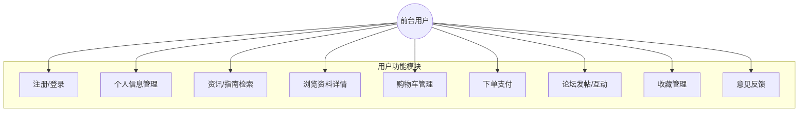

图 1 用户用例模型图

（2）在明确后台管理员职责与需求的基础上，构建系统后台管理员用例模型，具体如图 2 所示。

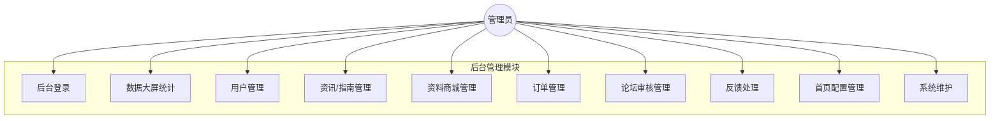

图2 管理员用例模型图

## 4.1 系统整体设计

本平台采用前后端分离的架构模式，前端选用 Vue 3 框架与 Element Plus 组件库搭建用户界面，优化界面美观度与易用性，并结合 ECharts 实现系统数据的可视化展示，便于用户与管理员直观查看数据信息。后端基于 Spring Boot 3 框架搭建核心架构，通过 MyBatis Plus 框架实现与 MySQL 数据库的交互，保障系统数据的持久化存储与访问安全性。同时引入支付宝沙箱支付功能，模拟用户购买考研资料等支付场景，满足系统业务流程需求。

### 4.1.1 项目架构设计

项目前端采用 Vue.js 框架构建应用程序，结合 HTML 语言与 CSS/SCSS 样式语言实现网站基本页面布局，利用 JavaScript/TypeScript 脚本语言实现用户交互的动态效果，通过 Axios 发送 GET、POST 等 HTTP 请求与后端进行数据通信，完成数据的传输与交互。系统后端基于 Spring Boot 架构进行设计，划分多个功能模块，采用标准的用户认证机制确保用户信息的安全传输，避免信息泄露。

支付场景方面，采用支付宝沙箱支付模拟用户消费行为，满足资料购买等核心业务的测试与运行需求；文件存储方面，用户上传的头像、资料附件等文件内容均存储于本地服务器或可扩展的对象存储服务中，实现文件的高效管理与快速访问。数据持久化层面，选用 MySQL 数据库存储系统所需全部数据，包括用户信息、考研指南、商城资料、评论内容、收藏记录等各类核心业务数据，确保数据的完整性与可追溯性。整个项目的架构设计如图3所示。

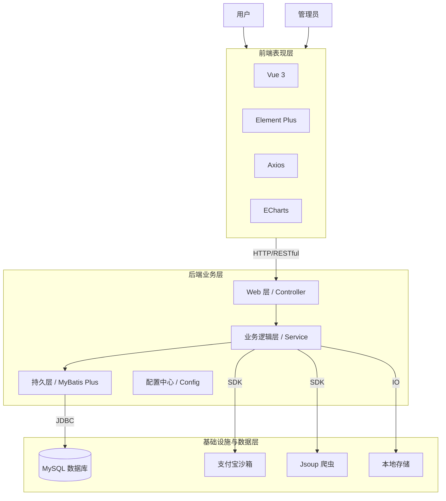

图3 项目架构图

### 4.1.2 项目模块设计

本项目后端基于 Spring Boot 框架进行开发，项目根目录结构清晰，在此基础上划分多个功能子模块，分别为 `config`、`controller`、`entity`、`mapper`、`service`、`utils` 和 `dto`，各模块各司其职、协同工作，确保系统功能的正常实现。

其中，`config` 模块负责项目的公共配置管理，包括数据库配置、CORS 跨域配置、支付宝配置等；`controller` 模块作为请求入口，负责接收前端发送的请求，并调用对应业务逻辑进行处理，返回 `Result` 统一结果对象；`entity` 模块用于定义整个项目的实体类结构，映射数据库中的数据表，明确数据字段与类型；`mapper` 模块负责与数据库直接交互，继承 MyBatis Plus 的 `BaseMapper` 接口，实现数据的增删改查操作；`service` 模块负责实现系统核心业务逻辑，调用 `mapper` 模块完成数据操作；`utils` 模块用于存放工具类与辅助函数，提供通用的工具方法，简化开发流程；`dto` 模块用于定义数据传输对象，规范前后端交互的数据结构。根据上述模块划分，可绘制系统项目结构设计图，具体如图4所示。

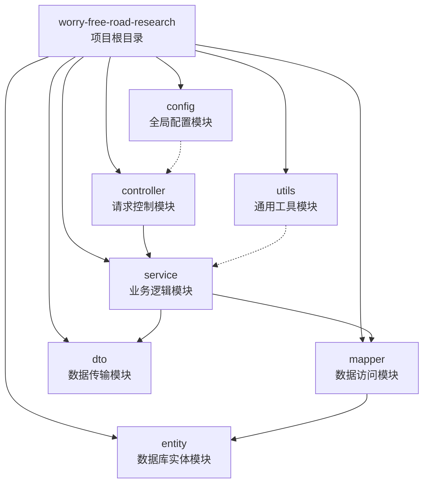

图4 项目结构设计图

在 `service` 模块中，根据具体的业务需求，可以进一步划分为多个子服务：

- `UserService`: 负责用户的注册、登录和个人信息管理；
- `GuideService`: 负责考研报考指南和复试经验的发布与管理；
- `NewsService`: 负责考研政策新闻的资讯管理；
- `MaterialService`: 负责考研资料商城的商品管理，包括上架、库存维护等；
- `OrderService` & `OrderItemService`: 负责处理用户购买资料的订单生成、支付状态更新及订单详情查询；
- `CartItemService`: 管理用户的购物车，支持添加资料、修改数量等操作；
- `PostService`: 负责考研论坛的帖子发布、审核及互动管理；
- `CommentService`: 管理用户对资讯、资料及帖子的评论信息；
- `FavoriteService`: 负责用户对指南、资料及帖子的收藏功能；
- `FeedbackService`: 处理用户提交的意见反馈；
- `CrawlerService`: 提供自动抓取外部考研资讯的爬虫服务；

## 4.2 系统关键业务设计

用户进入系统后，可通过两种方式获取目标资源：一是根据考研指南、资讯分类或资料商城等标签信息浏览选择；二是通过输入资料名称、院校名称、资讯关键词等进行检索，获取对应的列表。获取目标资源后，用户可查看详细内容或进行购买操作；点击资料进入详情界面后，可查看资料描述、规格、价格及用户评价；若确认购买，可将资料加入购物车或直接下单，随后跳转至支付宝沙箱支付界面完成付款。支付成功后，系统自动更新订单状态，用户可在个人中心查看已购资料并下载附件。整个资料购买的业务流程如图 5 所示。

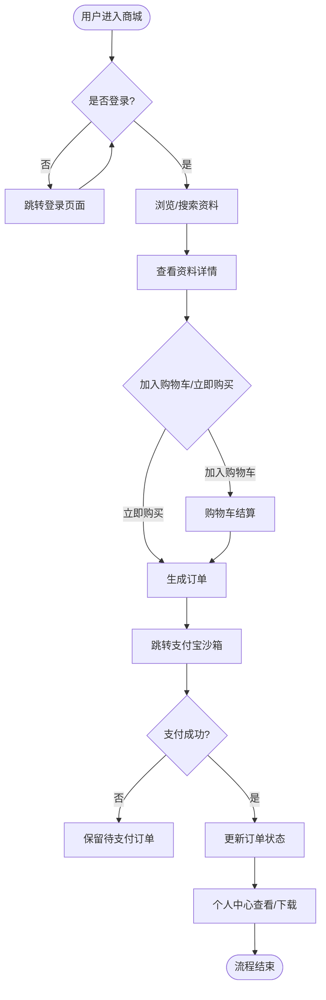

图 5 资料购买流程图

## 4.3 系统功能模块设计

结合系统需求分析结果，根据系统用户角色（普通用户、管理员）的不同，将系统功能模块划分为前台业务系统与后台管理系统两大模块，各模块功能设计围绕用户需求展开，确保功能完备、流程清晰，具体设计说明如下：

（1）前台业务系统主要面向普通用户，核心目标是为用户提供便捷的考研资讯获取与资料交易体验，主要功能包括：

- **资讯浏览与检索**：支持用户通过关键词搜索或分类筛选查找报考指南、复试经验及考研新闻；
- **资料商城**：允许用户浏览考研资料详情，查看价格、库存及评价，支持加入购物车与下单购买；
- **在线支付**：集成支付宝沙箱支付，支持扫码付款，实时反馈支付结果；
- **个人中心**：支持用户管理个人信息、收货地址，查看历史订单、收藏记录及我的评论；
- **互动社区**：支持用户发布经验贴、求助贴，与其他考研学子交流心得，支持点赞与评论互动；
- **意见反馈**：支持用户提交系统使用建议或问题，建立用户与平台的沟通渠道。

（2）后台管理系统主要面向管理员，核心目标是实现系统的全面管理与维护，主要功能包括：

- **数据大屏**：通过 ECharts 可视化图表展示注册用户数、资料销售额、帖子活跃度等关键指标；
- **用户管理**：支持管理员查询用户信息，分配或回收用户权限；
- **内容管理**：负责考研指南、新闻资讯的发布与维护，支持触发爬虫自动抓取最新动态；
- **商城管理**：负责考研资料的上架、下架、价格调整及库存管理；
- **订单管理**：实时监控交易状态，处理订单发货与售后问题；
- **社区管理**：审核用户发布的帖子与评论，删除违规内容，维护社区环境；
- **系统维护**：支持数据库自修复补丁运行，确保系统表结构稳定性。

系统功能结构如图 6 所示：

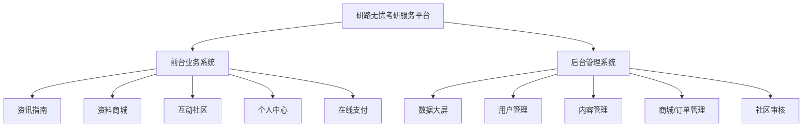

图 6 系统功能结构图

## 4.4 数据库设计

数据库设计是系统开发的核心环节之一，直接影响系统数据存储的安全性、完整性与访问效率。结合系统需求与技术选型，本系统数据库设计遵循安全性、完整性、性能优化三大原则，确保数据库能够适配系统业务需求，支撑系统稳定高效运行。

**数据库技术选型**：本系统选用 MySQL 数据库作为核心数据存储工具，结合 MyBatis Plus 框架实现数据访问层的开发，简化数据库操作流程。MySQL 数据库具备良好的兼容性与稳定性，能够有效处理结构化数据，适用于存储用户信息、考研指南、资料商城、论坛帖子等各类系统核心数据；同时其开源免费、支持大规模并发访问的特性，能够满足系统开发与运行的成本需求和性能需求。

**数据库设计原则**：
(1) 安全性：数据库安全性是系统稳定运行的基础，本系统通过设置合理的用户权限、采用 MD5/BCrypt 等算法加密用户密码、防止 SQL 注入攻击等方式，提升数据库的安全性。
(2) 完整性：为防止数据完整性被破坏，系统通过定义主键、外键、唯一性约束等方式，规范数据存储规则，同时通过 Service 层的数据校验机制，过滤非法数据。
(3) 性能：为提升系统数据检索效率，系统采用合理的索引设计，对常用查询字段（如 `username`、`title`、`category`、`sales`、`price`、`flash_end_time` 等）建立索引；同时优化 SQL 查询语句，利用 MyBatis Plus 的分页插件减少全表扫描，提升数据访问速度。

### 4.4.1 概念结构设计

结合系统需求分析，本系统数据库包含 15 张核心数据表，分别为：用户表 (sys\_user)、资讯表 (yl\_news)、指南表 (yl\_guide)、资料表 (yl\_material)、地址表 (address)、订单表 (yl\_order)、订单项表 (yl\_order\_item)、购物车表 (yl\_cart\_item)、帖子表 (yl\_post)、评论表 (yl\_comment)、收藏表 (favorite)、反馈表 (feedback)、首页配置表 (yl\_home\_config)、AI聊天消息表 (yl\_chat\_message) 和用户行为记录表 (yl\_user\_behavior)。本节梳理各实体的属性及实体间的关联关系，完成数据库概念模型设计。

**(1) 用户实体**：包含属性 id、账号 (username)、密码 (password)、昵称 (nickname)、邮箱 (email)、电话 (phone)、头像 (avatar)、角色 (role)、创建时间 (create\_time)、更新时间 (update\_time)、逻辑删除 (deleted)。用户实体属性图如图7所示：

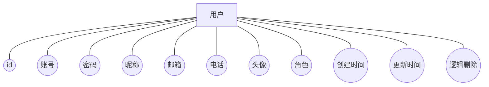

**(2) 资讯实体**：包含属性 id、标题 (title)、内容 (content)、类型 (type)、封面图 (cover\_img)、浏览量 (view\_count)、状态 (status)、评论数 (comment\_count)、创建时间 (create\_time)、更新时间 (update\_time)、逻辑删除 (deleted)。资讯实体属性图如图8所示：

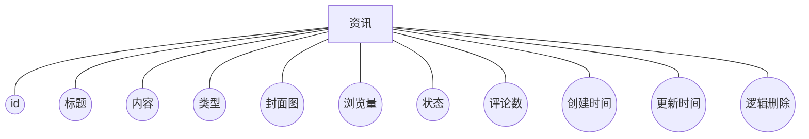

**(3) 指南实体**：包含属性 id、标题 (title)、内容 (content)、分类 (category)、封面图 (cover\_img)、浏览量 (view\_count)、状态 (status)、报考院校 (institution)、报考专业 (major)、评论数 (comment\_count)、创建时间 (create\_time)、更新时间 (update\_time)、逻辑删除 (deleted)。指南实体属性图如图9所示：

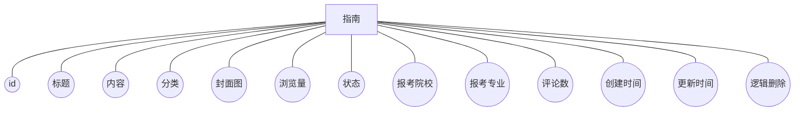

**(4) 资料实体**：包含属性 id、名称 (name)、描述 (description)、销售价 (price)、划线价 (original\_price)、库存 (stock)、销量 (sales)、分类 (category)、封面图 (cover\_img)、文件路径 (file\_url)、规格 (specs)、活动开始时间 (flash\_start\_time)、活动结束时间 (flash\_end\_time)、状态 (status)、创建时间 (create\_time)、更新时间 (update\_time)、逻辑删除 (deleted)。资料实体属性图如图10所示：

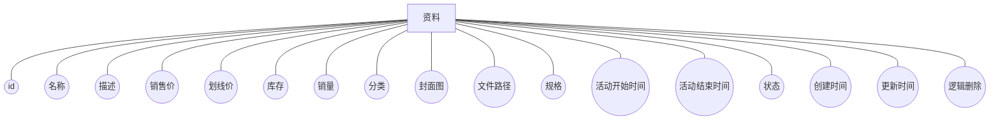

**(5) 收货地址实体**：包含属性 id、用户ID (user\_id)、收货人姓名 (receiver\_name)、收货人电话 (receiver\_phone)、省份 (province)、城市 (city)、区县 (district)、详细地址 (detail\_address)、是否默认 (is\_default)、创建时间 (create\_time)、更新时间 (update\_time)、逻辑删除 (deleted)。收货地址实体属性图如图11所示：

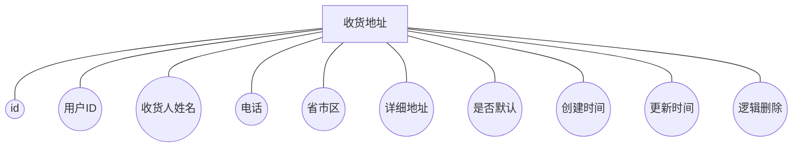

**(6) 订单实体**：包含属性 id、订单编号 (order\_no)、用户ID (user\_id)、总金额 (total\_amount)、状态 (status)、创建时间 (create\_time)、更新时间 (update\_time)、逻辑删除 (deleted)。订单实体属性图如图12所示：

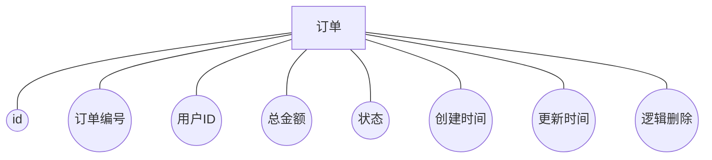

**(7) 订单项实体**：包含属性 id、订单ID (order\_id)、资料ID (material\_id)、资料名称 (material\_name)、价格 (price)、数量 (quantity)、创建时间 (create\_time)、更新时间 (update\_time)、逻辑删除 (deleted)。订单项实体属性图如图13所示：

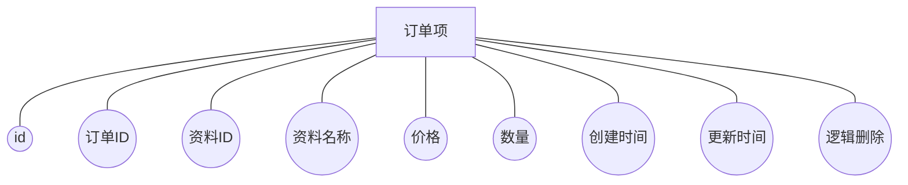

**(8) 购物车项实体**：包含属性 id、用户ID (user\_id)、资料ID (material\_id)、数量 (quantity)、创建时间 (create\_time)、更新时间 (update\_time)、逻辑删除 (deleted)。购物车项实体属性图如图14所示：

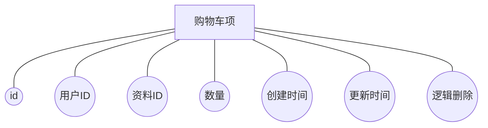

**(9) 帖子实体**：包含属性 id、标题 (title)、内容 (content)、作者ID (user\_id)、作者昵称 (nickname)、作者头像 (avatar)、浏览量 (view\_count)、点赞数 (like\_count)、评论数 (comment\_count)、板块分类 (category)、状态 (status)、是否置顶 (is\_top)、创建时间 (create\_time)、更新时间 (update\_time)、逻辑删除 (deleted)。帖子实体属性图如图15所示：

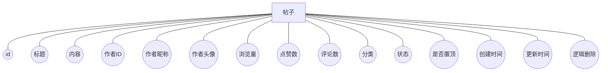

**(10) 评论实体**：包含属性 id、关联帖子ID (post\_id)、内容 (content)、用户ID (user\_id)、用户昵称 (nickname)、用户头像 (avatar)、目标类型 (target\_type)、目标ID (target\_id)、父评论ID (parent\_id)、被回复用户ID (reply\_to\_user\_id)、被回复用户昵称 (reply\_to\_nickname)、创建时间 (create\_time)、更新时间 (update\_time)、逻辑删除 (deleted)。评论实体属性图如图16所示：

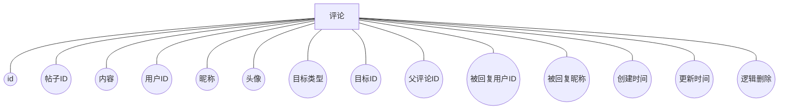

**(11) 收藏实体**：包含属性 id、用户ID (user\_id)、目标类型 (target\_type)、目标ID (target\_id)、目标标题 (target\_title)、目标封面 (target\_cover)、创建时间 (create\_time)、更新时间 (update\_time)、逻辑删除 (deleted)。收藏实体属性图如图17所示：

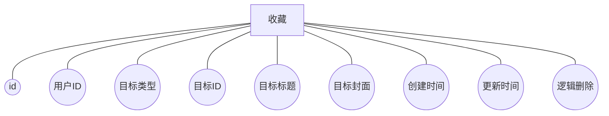

**(12) 意见反馈实体**：包含属性 id、用户ID (user\_id)、反馈内容 (content)、回复内容 (reply)、状态 (status)、回复时间 (reply\_time)、创建时间 (create\_time)、更新时间 (update\_time)、逻辑删除 (deleted)。意见反馈实体属性图如图18所示：

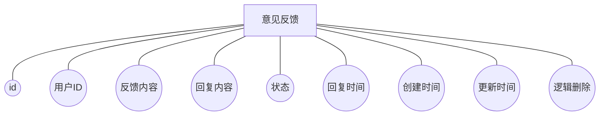

**(13) 首页配置实体**：包含属性 id、类型 (type)、标题 (title)、图片链接 (img\_url)、跳转链接 (link\_url)、排序 (sort\_order)、状态 (status)、创建时间 (create\_time)、更新时间 (update\_time)、逻辑删除 (deleted)。首页配置实体属性图如图19所示：

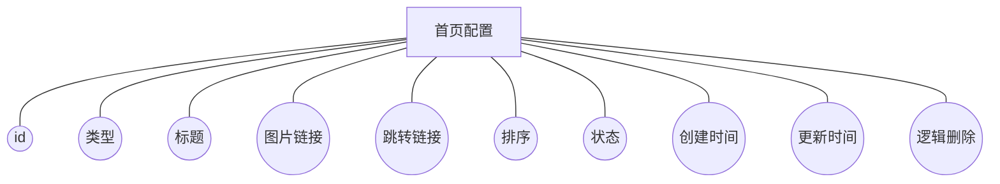

**(14) AI聊天消息实体**：包含属性 id、用户ID (user\_id)、会话ID (session\_id)、角色 (role)、消息内容 (content)、创建时间 (create\_time)、更新时间 (update\_time)、逻辑删除 (deleted)。AI聊天消息实体属性图如图20所示：

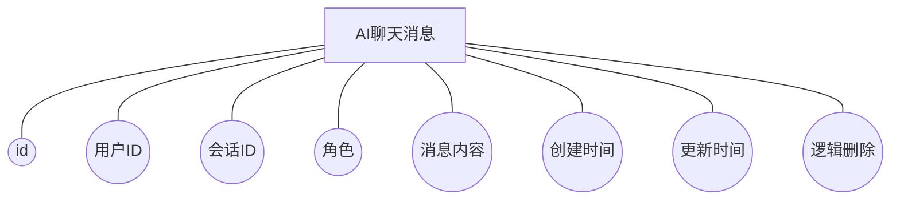

**(15) 用户行为记录实体**：包含属性 id、用户ID (user\_id)、行为类型 (behavior\_type)、目标类型 (target\_type)、目标ID (target\_id)、目标标题 (target\_title)、创建时间 (create\_time)、更新时间 (update\_time)、逻辑删除 (deleted)。用户行为记录实体属性图如图21所示：

```mermaid
graph TD
    UserBehavior[用户行为记录]
    UserBehavior --- ID((id))
    UserBehavior --- UserId((用户ID))
    UserBehavior --- BehaviorType((行为类型))
    UserBehavior --- TargetType((目标类型))
    UserBehavior --- TargetId((目标ID))
    UserBehavior --- TargetTitle((目标标题))
    UserBehavior --- CreateTime((创建时间))
    UserBehavior --- UpdateTime((更新时间))
    UserBehavior --- Deleted((逻辑删除))
```

结合上述各实体属性，梳理各实体间的关联关系，可绘制系统全局 E-R 图，具体如图 22 所示：

```mermaid
erDiagram
    User ||--o{ Order : places
    User ||--o{ Post : publishes
    User ||--o{ Comment : writes
    User ||--o{ Favorite : has
    User ||--o{ Address : owns
    User ||--o{ Feedback : submits
    User ||--o{ ChatMessage : sends
    User ||--o{ UserBehavior : generates

    Order ||--|{ OrderItem : contains
    OrderItem }|--|| Material : refers_to

    Post ||--o{ Comment : receives

    Material ||--o{ CartItem : in
    User ||--o{ CartItem : owns

    User }|..|{ News : reads
    User }|..|{ Guide : reads
```

### 4.4.2 逻辑结构设计

数据库逻辑结构设计是在概念结构设计的基础上，对数据组织方式、数据表及字段关系进行抽象、规范与优化的过程，核心目标是将概念模型转化为可实际落地的关系模型，支持复杂查询操作，提升数据完整性与系统性能，便于数据维护与后期扩展，确保数据管理的一致性。以下是本“研路无忧”考研服务平台各核心数据表的详细逻辑结构。

用户信息表用于存储用户的详细信息，为用户身份验证、管理和个性化服务提供基础数据，并增强用户体验与互动，这是系统用户管理的核心组成部分，详情见表1。
表1 用户信息表（sys\_user）

| 字段名          | 数据类型     | 长度  | 是否主键 | 可否为空 | 注释   |
| :----------- | :------- | :-- | :--- | :--- | :--- |
| id           | bigint   | 20  | YES  | NO   | 主键   |
| username     | varchar  | 64  | NO   | NO   | 账号   |
| password     | varchar  | 128 | NO   | NO   | 密码   |
| nickname     | varchar  | 64  | NO   | YES  | 昵称   |
| email        | varchar  | 64  | NO   | YES  | 邮箱   |
| phone        | varchar  | 20  | NO   | YES  | 电话   |
| avatar       | varchar  | 255 | NO   | YES  | 头像   |
| role         | varchar  | 20  | NO   | NO   | 角色   |
| create\_time | datetime | 0   | NO   | YES  | 创建时间 |
| update\_time | datetime | 0   | NO   | YES  | 更新时间 |
| deleted      | tinyint  | 1   | NO   | YES  | 逻辑删除 |

考研资讯表主要用于存储各类考研新闻、政策解读及考试动态，为用户提供及时、准确的备考信息，详情见表2。
表2 考研资讯表（yl\_news）

| 字段名            | 数据类型     | 长度  | 是否主键 | 可否为空 | 注释   |
| :------------- | :------- | :-- | :--- | :--- | :--- |
| id             | bigint   | 20  | YES  | NO   | 主键   |
| title          | varchar  | 255 | NO   | NO   | 标题   |
| content        | longtext | 0   | NO   | YES  | 内容   |
| type           | varchar  | 50  | NO   | YES  | 资讯类型 |
| cover\_img     | varchar  | 255 | NO   | YES  | 封面图  |
| view\_count    | int      | 11  | NO   | YES  | 浏览量  |
| status         | tinyint  | 4   | NO   | YES  | 状态   |
| comment\_count | int      | 11  | NO   | YES  | 评论数  |
| create\_time   | datetime | 0   | NO   | YES  | 创建时间 |
| update\_time   | datetime | 0   | NO   | YES  | 更新时间 |
| deleted        | tinyint  | 1   | NO   | YES  | 逻辑删除 |

报考指南表用于管理各高校的招生简章、专业目录及复试细则，帮助考生精准定位目标院校与专业，详情见表3。
表3 报考指南表（yl\_guide）

| 字段名            | 数据类型     | 长度  | 是否主键 | 可否为空 | 注释   |
| :------------- | :------- | :-- | :--- | :--- | :--- |
| id             | bigint   | 20  | YES  | NO   | 主键   |
| title          | varchar  | 255 | NO   | NO   | 标题   |
| content        | longtext | 0   | NO   | YES  | 内容   |
| category       | varchar  | 50  | NO   | YES  | 分类   |
| cover\_img     | varchar  | 255 | NO   | YES  | 封面图  |
| view\_count    | int      | 11  | NO   | YES  | 浏览量  |
| status         | tinyint  | 4   | NO   | YES  | 状态   |
| institution    | varchar  | 100 | NO   | YES  | 报考院校 |
| major          | varchar  | 100 | NO   | YES  | 报考专业 |
| comment\_count | int      | 11  | NO   | YES  | 评论数  |
| create\_time   | datetime | 0   | NO   | YES  | 创建时间 |
| update\_time   | datetime | 0   | NO   | YES  | 更新时间 |
| deleted        | tinyint  | 1   | NO   | YES  | 逻辑删除 |

考研资料表用于存储商城内的各类复习资料信息，包括资料名称、价格、库存、文件路径及限时活动信息，支持商品展示、活动计算与下单购买，详情见表4。
表4 考研资料表（yl\_material）

| 字段名              | 数据类型     | 长度   | 是否主键 | 可否为空 | 注释     |
| :--------------- | :------- | :--- | :--- | :--- | :----- |
| id               | bigint   | 20   | YES  | NO   | 主键     |
| name             | varchar  | 255  | NO   | NO   | 资料名称   |
| description      | text     | 0    | NO   | YES  | 描述     |
| price            | decimal  | 10,2 | NO   | NO   | 销售价    |
| original\_price  | decimal  | 10,2 | NO   | YES  | 划线价    |
| stock            | int      | 11   | NO   | YES  | 库存     |
| category         | varchar  | 50   | NO   | YES  | 分类     |
| cover\_img       | varchar  | 255  | NO   | YES  | 封面图    |
| file\_url        | varchar  | 255  | NO   | YES  | 文件路径   |
| specs            | varchar  | 255  | NO   | YES  | 规格     |
| sales            | int      | 11   | NO   | YES  | 销量     |
| flash\_start\_time | datetime | 0    | NO   | YES  | 活动开始时间 |
| flash\_end\_time   | datetime | 0    | NO   | YES  | 活动结束时间 |
| status           | tinyint  | 4    | NO   | YES  | 状态     |
| create\_time     | datetime | 0    | NO   | YES  | 创建时间   |
| update\_time     | datetime | 0    | NO   | YES  | 更新时间   |
| deleted          | tinyint  | 1    | NO   | YES  | 逻辑删除   |

收货地址表用于维护用户的物流配送信息，支持多地址管理与默认地址设置，确保实体资料或发票的准确送达，详情见表5。
表5 收货地址表（address）

| 字段名             | 数据类型     | 长度  | 是否主键 | 可否为空 | 注释    |
| :-------------- | :------- | :-- | :--- | :--- | :---- |
| id              | bigint   | 20  | YES  | NO   | 主键    |
| user\_id        | bigint   | 20  | NO   | NO   | 用户ID  |
| receiver\_name  | varchar  | 64  | NO   | NO   | 收货人姓名 |
| receiver\_phone | varchar  | 20  | NO   | NO   | 收货人电话 |
| province        | varchar  | 50  | NO   | YES  | 省份    |
| city            | varchar  | 50  | NO   | YES  | 城市    |
| district        | varchar  | 50  | NO   | YES  | 区县    |
| detail\_address | varchar  | 255 | NO   | NO   | 详细地址  |
| is\_default     | tinyint  | 1   | NO   | YES  | 是否默认  |
| create\_time    | datetime | 0   | NO   | YES  | 创建时间  |
| update\_time    | datetime | 0   | NO   | YES  | 更新时间  |
| deleted         | tinyint  | 1   | NO   | YES  | 逻辑删除  |

订单信息表用于记录用户购买资料的交易详情，包括订单编号、总金额及支付状态，是平台交易流转的核心凭证，详情见表6。
表6 订单信息表（yl\_order）

| 字段名           | 数据类型     | 长度   | 是否主键 | 可否为空 | 注释   |
| :------------ | :------- | :--- | :--- | :--- | :--- |
| id            | bigint   | 20   | YES  | NO   | 主键   |
| order\_no     | varchar  | 64   | NO   | YES  | 订单编号 |
| user\_id      | bigint   | 20   | NO   | YES  | 用户ID |
| total\_amount | decimal  | 10,2 | NO   | YES  | 总金额  |
| status        | int      | 11   | NO   | YES  | 状态   |
| create\_time  | datetime | 0    | NO   | YES  | 创建时间 |
| update\_time  | datetime | 0    | NO   | YES  | 更新时间 |
| deleted       | tinyint  | 1    | NO   | YES  | 逻辑删除 |

订单项表用于存储订单中包含的具体商品明细，通过关联订单与资料表，实现一单多品的精细化管理，详情见表7。
表7 订单项表（yl\_order\_item）

| 字段名            | 数据类型     | 长度   | 是否主键 | 可否为空 | 注释   |
| :------------- | :------- | :--- | :--- | :--- | :--- |
| id             | bigint   | 20   | YES  | NO   | 主键   |
| order\_id      | bigint   | 20   | NO   | YES  | 订单ID |
| material\_id   | bigint   | 20   | NO   | YES  | 资料ID |
| material\_name | varchar  | 255  | NO   | YES  | 资料名称 |
| price          | decimal  | 10,2 | NO   | YES  | 价格   |
| quantity       | int      | 11   | NO   | YES  | 数量   |
| create\_time   | datetime | 0    | NO   | YES  | 创建时间 |
| update\_time   | datetime | 0    | NO   | YES  | 更新时间 |
| deleted        | tinyint  | 1    | NO   | YES  | 逻辑删除 |

购物车项表用于暂存用户意向购买的资料，支持数量调整与批量结算，提升用户的选购体验与转化率，详情见表8。
表8 购物车项表（yl\_cart\_item）

| 字段名          | 数据类型     | 长度 | 是否主键 | 可否为空 | 注释   |
| :----------- | :------- | :- | :--- | :--- | :--- |
| id           | bigint   | 20 | YES  | NO   | 主键   |
| user\_id     | bigint   | 20 | NO   | YES  | 用户ID |
| material\_id | bigint   | 20 | NO   | YES  | 资料ID |
| quantity     | int      | 11 | NO   | YES  | 数量   |
| create\_time | datetime | 0  | NO   | YES  | 创建时间 |
| update\_time | datetime | 0  | NO   | YES  | 更新时间 |
| deleted      | tinyint  | 1  | NO   | YES  | 逻辑删除 |

帖子信息表用于存储用户在互动社区发布的经验分享与求助内容，支持富文本编辑与分类展示，促进考研学子的深度交流，详情见表9。
表9 帖子信息表（yl\_post）

| 字段名            | 数据类型     | 长度  | 是否主键 | 可否为空 | 注释   |
| :------------- | :------- | :-- | :--- | :--- | :--- |
| id             | bigint   | 20  | YES  | NO   | 主键   |
| title          | varchar  | 255 | NO   | YES  | 标题   |
| content        | longtext | 0   | NO   | YES  | 内容   |
| user\_id       | bigint   | 20  | NO   | YES  | 作者ID |
| nickname       | varchar  | 64  | NO   | YES  | 作者昵称 |
| avatar         | varchar  | 255 | NO   | YES  | 作者头像 |
| view\_count    | int      | 11  | NO   | YES  | 浏览量  |
| like\_count    | int      | 11  | NO   | YES  | 点赞数  |
| comment\_count | int      | 11  | NO   | YES  | 评论数  |
| category       | int      | 11  | NO   | YES  | 板块分类 |
| status         | int      | 11  | NO   | YES  | 状态   |
| is\_top        | int      | 11  | NO   | YES  | 是否置顶 |
| create\_time   | datetime | 0   | NO   | YES  | 创建时间 |
| update\_time   | datetime | 0   | NO   | YES  | 更新时间 |
| deleted        | tinyint  | 1   | NO   | YES  | 逻辑删除 |

评论信息表用于记录用户对资讯、资料及帖子的互动反馈，支持多级回复与内容审核，营造活跃且规范的社区氛围，详情见表10。
表10 评论信息表（yl\_comment）

| 字段名                 | 数据类型     | 长度  | 是否主键 | 可否为空 | 注释      |
| :------------------ | :------- | :-- | :--- | :--- | :------ |
| id                  | bigint   | 20  | YES  | NO   | 主键      |
| post\_id            | bigint   | 20  | NO   | YES  | 关联ID    |
| content             | text     | 0   | NO   | YES  | 内容      |
| user\_id            | bigint   | 20  | NO   | YES  | 用户ID    |
| nickname            | varchar  | 64  | NO   | YES  | 昵称      |
| avatar              | varchar  | 255 | NO   | YES  | 头像      |
| target\_type        | int      | 11  | NO   | YES  | 目标类型    |
| target\_id          | bigint   | 20  | NO   | YES  | 目标ID    |
| parent\_id          | bigint   | 20  | NO   | YES  | 父评论ID   |
| reply\_to\_user\_id | bigint   | 20  | NO   | YES  | 被回复用户ID |
| reply\_to\_nickname | varchar  | 50  | NO   | YES  | 被回复昵称   |
| create\_time        | datetime | 0   | NO   | YES  | 创建时间    |
| update\_time        | datetime | 0   | NO   | YES  | 更新时间    |
| deleted             | tinyint  | 1   | NO   | YES  | 逻辑删除    |

收藏信息表用于存储用户关注的各类资源，方便用户快速回访感兴趣的资讯、指南或资料，打造个性化的备考资料库，详情见表11。
表11 收藏信息表（favorite）

| 字段名           | 数据类型     | 长度  | 是否主键 | 可否为空 | 注释   |
| :------------ | :------- | :-- | :--- | :--- | :--- |
| id            | bigint   | 20  | YES  | NO   | 主键   |
| user\_id      | bigint   | 20  | NO   | NO   | 用户ID |
| target\_type  | int      | 11  | NO   | NO   | 目标类型 |
| target\_id    | bigint   | 20  | NO   | NO   | 目标ID |
| target\_title | varchar  | 255 | NO   | YES  | 目标标题 |
| target\_cover | varchar  | 255 | NO   | YES  | 目标封面 |
| create\_time  | datetime | 0   | NO   | YES  | 创建时间 |
| update\_time  | datetime | 0   | NO   | YES  | 更新时间 |
| deleted       | tinyint  | 1   | NO   | YES  | 逻辑删除 |

意见反馈表用于收集用户对平台的使用建议与问题报告，支持管理员回复与状态跟踪，是持续优化系统服务的重要依据，详情见表12。
表12 意见反馈表（feedback）

| 字段名          | 数据类型     | 长度 | 是否主键 | 可否为空 | 注释   |
| :----------- | :------- | :- | :--- | :--- | :--- |
| id           | bigint   | 20 | YES  | NO   | 主键   |
| user\_id     | bigint   | 20 | NO   | NO   | 用户ID |
| content      | text     | 0  | NO   | NO   | 反馈内容 |
| reply        | text     | 0  | NO   | YES  | 回复内容 |
| status       | int      | 11 | NO   | YES  | 状态   |
| reply\_time  | datetime | 0  | NO   | YES  | 回复时间 |
| create\_time | datetime | 0  | NO   | YES  | 创建时间 |
| update\_time | datetime | 0  | NO   | YES  | 更新时间 |
| deleted      | tinyint  | 1  | NO   | YES  | 逻辑删除 |

首页配置表用于管理系统首页的轮播图与公告栏内容，支持灵活配置跳转链接与展示顺序，提升平台的运营效率与信息触达率，详情见表13。
表13 首页配置表（yl\_home\_config）

| 字段名          | 数据类型     | 长度  | 是否主键 | 可否为空 | 注释   |
| :----------- | :------- | :-- | :--- | :--- | :--- |
| id           | bigint   | 20  | YES  | NO   | 主键   |
| type         | varchar  | 20  | NO   | NO   | 类型   |
| title        | varchar  | 255 | NO   | YES  | 标题   |
| img\_url     | varchar  | 255 | NO   | YES  | 图片链接 |
| link\_url    | varchar  | 255 | NO   | YES  | 跳转链接 |
| sort\_order  | int      | 11  | NO   | YES  | 排序   |
| status       | tinyint  | 4   | NO   | YES  | 状态   |
| create\_time | datetime | 0   | NO   | YES  | 创建时间 |
| update\_time | datetime | 0   | NO   | YES  | 更新时间 |
| deleted      | tinyint  | 1  | NO   | YES  | 逻辑删除 |

AI聊天消息表用于存储用户与AI助手的对话记录，支持多会话管理和上下文关联，为用户提供智能化的考研咨询与备考答疑服务，详情见表14。
表14 AI聊天消息表（yl_chat_message）

| 字段名          | 数据类型     | 长度  | 是否主键 | 可否为空 | 注释   |
| :----------- | :------- | :-- | :--- | :--- | :--- |
| id           | bigint   | 20  | YES  | NO   | 主键   |
| user_id      | bigint   | 20  | NO   | NO   | 用户ID |
| session_id   | varchar  | 64  | NO   | NO   | 会话ID |
| role         | int      | 11  | NO   | NO   | 角色   |
| content      | text     | 0   | NO   | NO   | 消息内容 |
| create_time  | datetime | 0   | NO   | YES  | 创建时间 |
| update_time  | datetime | 0   | NO   | YES  | 更新时间 |
| deleted      | tinyint  | 1   | NO   | YES  | 逻辑删除 |

用户行为记录表用于采集与存储用户在平台上的各类行为数据，包括浏览、收藏、购买、搜索及评论等操作，为个性化推荐与精准营销提供数据支撑，详情见表15。
表15 用户行为记录表（yl_user_behavior）

| 字段名           | 数据类型     | 长度  | 是否主键 | 可否为空 | 注释   |
| :------------ | :------- | :-- | :--- | :--- | :--- |
| id            | bigint   | 20  | YES  | NO   | 主键   |
| user_id       | bigint   | 20  | NO   | NO   | 用户ID |
| behavior_type | int      | 11  | NO   | NO   | 行为类型 |
| target_type   | int      | 11  | NO   | YES  | 目标类型 |
| target_id     | bigint   | 20  | NO   | NO   | 目标ID |
| target_title  | varchar  | 255 | NO   | YES  | 目标标题 |
| create_time   | datetime | 0   | NO   | YES  | 创建时间 |
| update_time   | datetime | 0   | NO   | YES  | 更新时间 |
| deleted       | tinyint  | 1   | NO   | YES  | 逻辑删除 |

# 5 系统实现

## 5.1 关键技术实现

### 5.1.1 沙箱支付


在“研路无忧”考研资讯与资料分享平台中，为了实现真实且安全的在线交易功能，同时降低开发与测试成本，系统集成了支付宝沙箱环境（Alipay Sandbox）。沙箱环境是支付宝开放平台提供的一套独立的模拟测试环境，它复制了线上真实的支付流程与接口能力，但涉及的资金流转均为虚拟，无需绑定真实银行卡，非常适合在开发阶段进行接口调试与业务逻辑验证。本系统采用支付宝电脑网站支付（Alipay Trade Page Pay）接口，实现了从订单生成、支付跳转、用户付款到支付结果回调的全链路闭环。


**#### 1. 沙箱环境配置与核心参数**


系统的支付功能依赖于一系列关键配置参数，这些参数在 `application.yml` 配置文件与 `AlipayConfig` 配置类中进行管理。


首先，系统需要配置支付宝沙箱网关地址 `gatewayUrl`，其值为 `https://openapi-sandbox.dl.alipaydev.com/gateway.do`，这是沙箱环境专用的API入口。其次，为了确保通信安全，采用了 RSA2（SHA256WithRSA）非对称加密算法进行签名与验签。核心凭证包括：

\*  ***\*AppID\****：沙箱应用的唯一标识（如 `9021000162609598`），用于支付宝识别商户身份。

\*  ***\*应用私钥（AppPrivateKey）\****：由开发者生成并保存在服务端，用于对发送给支付宝的请求参数进行签名，防止请求被篡改。

\*  ***\*支付宝公钥（AlipayPublicKey）\****：由支付宝生成并提供，配置在服务端，用于验证支付宝返回的异步通知或同步跳转数据的合法性，确保数据确实来自支付宝且未被篡改。


此外，为了接收支付结果，系统配置了两个关键的 URL 地址：

\*  ***\*同步跳转地址（ReturnUrl）\****：用户在支付宝页面完成支付后，浏览器会自动跳转回该地址（如前端的支付成功页），主要用于展示支付结果，不作为交易成功的最终依据。

\*  ***\*异步通知地址（NotifyUrl）\****：支付宝服务器在交易状态发生变更时，会主动向该地址发送 POST 请求。这是系统更新订单状态的核心依据，要求该地址必须是公网可访问的。在开发环境中，本项目使用了 NATAPP 内网穿透工具，将本地的 `localhost:8080` 映射为公网域名（如 `http://d6bb9254.natappfree.cc`），从而实现本地开发环境与支付宝服务器的交互。


图39展示了支付宝沙箱应用的配置界面，其中包含了上述关键信息。


图39 支付宝沙箱应用配置界面


**#### 2. 支付流程设计与交互逻辑**


本系统的支付流程设计遵循标准的第三方支付规范，主要分为订单创建、发起支付、用户付款、同步跳转与异步回调五个阶段。该过程的完整时序逻辑如图23所示：

```mermaid
sequenceDiagram
    autonumber
    actor User as 用户
    participant Frontend as 前端(Vue3)
    participant Backend as 后端(SpringBoot)
    participant Alipay as 支付宝沙箱环境

    User->>Frontend: 点击“去结算”或“去支付”
    Frontend->>Backend: 请求创建订单 /order/create
    Backend-->>Frontend: 返回订单号及待支付状态
    Frontend->>Backend: 发起支付 /order/pay/{id}
    Backend->>Backend: 校验订单状态及金额
    Backend->>Alipay: 封装参数调用 AlipayClient.pageExecute
    Alipay-->>Backend: 返回包含自动提交脚本的 HTML 表单
    Backend-->>Frontend: 将 HTML 表单直接返回给浏览器
    Frontend->>Alipay: 浏览器渲染并自动提交表单跳转
    Alipay-->>User: 展示支付宝沙箱收银台
    User->>Alipay: 登录沙箱买家账号完成付款
    Alipay->>Alipay: 校验密码并扣款
    
    par 异步通知（核心状态更新）
        Alipay->>Backend: 发送 POST 请求至 NotifyUrl
        Backend->>Backend: 验证签名(rsaCheckV1)并校验金额
        Backend->>Backend: 更新数据库订单状态为“已支付”
        Backend-->>Alipay: 返回 "success"
    and 同步跳转（前端展示）
        Alipay->>Frontend: 浏览器重定向至 ReturnUrl
        Frontend->>Backend: 携带参数请求后端进行同步验签
        Backend-->>Frontend: 验签通过
        Frontend-->>User: 跳转至“支付成功”结果页
    end
```
<div align="center">图23 沙箱支付时序图</div>


***\*(1) 订单创建阶段\****

用户在资料商城选择商品或在购物车结算时，前端调用 `OrderController` 的 `create` 接口。后端 `OrderServiceImpl` 创建订单记录，生成唯一的订单号（格式为“yyyyMMddHHmmss”+雪花算法ID），并将订单状态初始化为 `0`（待付款）。


***\*(2) 发起支付阶段\****

用户点击“去支付”按钮，前端请求 `/order/pay/{id}` 接口。后端首先校验订单状态，确保未支付且未过期。随后，利用 `AlipayClient` SDK 封装支付请求参数 `AlipayTradePagePayRequest`。请求参数包括商户订单号 `out_trade_no`、订单总金额 `total_amount`、订单标题 `subject` 以及产品码 `product_code`（固定为 `FAST_INSTANT_TRADE_PAY`）。调用 `alipayClient.pageExecute(request)` 方法后，SDK 会生成一个包含自动提交脚本的 HTML 表单字符串。后端将此 HTML 字符串直接返回给前端，浏览器接收后自动执行脚本，重定向至支付宝沙箱收银台。


***\*(3) 用户付款阶段\****

页面跳转至支付宝沙箱收银台后，用户使用沙箱版支付宝 App 扫码，或输入沙箱买家账号与密码完成支付。此过程完全由支付宝托管，确保了用户敏感信息的安全。支付界面如图40所示。


图40 支付宝沙箱支付收银台界面


***\*(4) 支付回调与状态更新\****

支付完成后，支付宝会并行触发同步跳转与异步通知。

\*  ***\*同步跳转\****：浏览器重定向至 `ReturnUrl`，携带支付参数。后端接口 `alipayReturn` 接收请求，通过 `AlipaySignature.rsaCheckV1` 方法验证签名合法性。验证通过后，后端重定向用户至前端的“支付成功”页面，提升用户体验。

\*  ***\*异步通知（核心）\****：支付宝服务器向 `NotifyUrl` 发送 POST 请求，包含交易状态 `trade_status`。后端接口 `alipayNotify` 接收请求，同样进行签名验证。验证通过后，检查 `trade_status` 是否为 `TRADE_SUCCESS` 或 `TRADE_FINISHED`。若确认交易成功，后端查询数据库中的对应订单，将其状态更新为 `1`（已支付），并记录支付时间。为了防止网络波动导致的重复通知，系统在更新状态前会通过幂等性校验，确保同一笔订单只会被处理一次。最后，后端向支付宝返回字符串 `success`，告知通知已成功接收，否则支付宝会按策略进行重试。


**#### 3. 关键代码实现解析**


支付功能的实现主要集中在 `OrderServiceImpl` 类中。`payOrder` 方法负责构建支付表单，代码逻辑严谨地处理了金额格式化与参数封装：


\```java

// 核心代码片段：发起支付

AlipayTradePagePayRequest request = new AlipayTradePagePayRequest();

request.setNotifyUrl(alipayConfig.getNotifyUrl());

request.setReturnUrl(alipayConfig.getReturnUrl());

request.setBizContent("{" +

​    "\"out_trade_no\":\"" + order.getOrderNo() + "\"," +

​    "\"total_amount\":\"" + totalAmount + "\"," +

​    "\"subject\":\"" + subject + "\"," +

​    "\"product_code\":\"FAST_INSTANT_TRADE_PAY\"" +

​    "}");

// 生成表单

String form = alipayClient.pageExecute(request).getBody();

\```


而 `handleAlipayNotify` 方法则承担了安全防线的角色，通过严格的签名校验防止伪造请求：


\```java

// 核心代码片段：验签与状态更新

boolean signVerified = AlipaySignature.rsaCheckV1(params, alipayConfig.getAlipayPublicKey(), 

​                        alipayConfig.getCharset(), alipayConfig.getSignType());

if (signVerified) {

  String tradeStatus = params.get("trade_status");

  if ("TRADE_SUCCESS".equals(tradeStatus)) {

​    // 更新订单状态逻辑

​    updateOrderStatus(orderId, 1);

  }

}

\```


通过上述设计与实现，“研路无忧”平台构建了一个安全、稳定且闭环的支付系统，既满足了业务需求，又保证了交易数据的准确性与一致性。沙箱环境的应用极大地提升了开发效率，确保了系统上线前的支付功能经过了充分的验证。

### 5.1.2 数据爬虫

为了丰富平台的考研资讯与报考指南内容，系统引入了 `Jsoup` 库实现数据爬虫功能，能够自动抓取外部考研网站的公开数据。核心逻辑实现于 `CrawlerServiceImpl` 类中。

`crawlGuides` 方法接收目标 URL 和分类参数，首先使用 `Jsoup.connect(url).get()` 发起 HTTP 请求获取目标网页的 HTML 文档。针对不同结构的网页（如列表页），系统通过 CSS 选择器（如 `.list-item a`、`.article-list a` 等）定位并提取文章链接。

在获取到文章详情页链接后，爬虫进一步访问详情页，解析文章的标题、发布时间、正文内容以及相关的院校信息。系统采用智能提取策略，例如从标题中识别“XX大学”或“XX学院”作为报考院校字段。解析完成后，爬虫将数据封装为 `Guide` 实体对象，并调用 `GuideService` 将其持久化存储到数据库中。为避免对目标网站造成过大压力，爬虫在每次请求之间设置了合理的延时，并限制了单次抓取的最大数量。

### 5.1.3 接口文档管理

本系统采用 `Knife4j` 框架进行 API 接口文档的自动生成与管理。`Knife4j` 是基于 Swagger 的增强解决方案，提供了更加友好、美观的文档界面，便于前端开发人员查阅接口定义与调试。

在后端开发过程中，开发人员只需在 Controller 层的方法上添加标准的 Swagger 注解（如 `@Operation`、`@Tag` 等），`Knife4j` 即可自动扫描并解析这些元数据，生成在线接口文档。文档中详细展示了每个接口的请求路径、请求方法、请求参数（包含类型、是否必填、说明）以及响应结构。

此外，`Knife4j` 还提供了在线调试功能。开发者可以直接在文档页面输入测试参数，发送请求并查看实时响应结果，极大地提升了前后端联调的效率，降低了沟通成本。

## 5.2 前台功能模块实现

### 5.2.1 登录注册

登录注册模块不仅是用户进入“研路无忧”考研服务平台的通行证，更是保障平台安全性、实现用户个性化服务的基石。该模块的设计遵循“安全、便捷、美观”的原则，前端采用 Vue 3 组合式 API 结合 Element Plus 组件库构建，界面设计上采用了现代化的左右分栏布局：左侧为品牌形象展示区，轮播展示“研路无忧”的 Slogan 和精美插画，旨在传递积极向上的备考理念；右侧为交互表单区，清晰地展示登录与注册的输入项。在响应式设计方面，系统通过 CSS 媒体查询（Media Queries）自动识别设备屏幕宽度，在移动端设备上自动隐藏左侧品牌区，仅保留表单区并居中显示，确保了在不同终端上的一致性体验。

登录界面是用户与平台交互的第一步。系统使用 Element UI 中的 `el-form` 表单组件，实现输入框数据的双向绑定。为了确保数据的规范性，前端绑定了自定义表单验证规则（`rules`）。例如，账号字段要求长度在 4 到 16 位之间，且只能包含字母和数字；密码字段则要求至少 8 位，并包含大小写字母及特殊符号。这些规则通过 `async-validator` 库进行实时校验，当用户输入不符合规范时，输入框下方会立即显示红色的错误提示信息，避免无效请求发送至服务器。此外，为了防止暴力破解和恶意撞库攻击，系统引入了图形验证码机制。前端通过 `` 标签加载后端生成的 Base64 格式验证码图片，并绑定点击刷新事件，用户需输入正确的验证码才能提交登录请求。登录界面如图30所示。

图30 前台用户登录界面图

注册界面则是新用户加入平台的必经之路。在注册流程中，用户需填写用户名、密码、确认密码、昵称、手机号及邮箱。前端同样利用正则表达式对手机号（`/^1[3-9]\d{9}$/`）和邮箱格式（`/^[\w-]+(\.[\w-]+)*@[\w-]+(\.[\w-]+)+$/`）进行严格匹配。为了提升用户体验，系统在用户输入用户名或手机号后，会通过 `blur` 事件触发异步请求，调用后端接口检查该用户名或手机号是否已被注册。若已被注册，输入框右侧会显示“已存在”的提示图标，引导用户更换。当所有字段校验通过后，用户点击注册按钮，系统将加密后的表单数据提交至服务器，完成注册流程。注册成功后，系统会弹出 `ElMessage` 提示“注册成功”，并自动跳转到登录界面，同时预填充刚才注册的账号，方便用户直接登录。注册界面如图31所示。

图31 前台用户注册界面图

登录注册功能的具体实现逻辑如下：界面状态由 `isLogin` 响应式变量控制，通过 `v-if/v-else` 指令动态切换登录与注册表单，配合 `Transition` 组件实现平滑的过渡动画。
当用户提交登录请求时，前端首先对密码进行 RSA 非对称加密，确保明文密码在传输过程中不被窃取。后端 `AuthController` 接收请求后，执行以下步骤：
1.  **验证码校验**：从 Redis 中根据 SessionId 获取存储的验证码，与用户输入的验证码进行比对（忽略大小写）。若不一致，抛出 `CaptchaException` 异常。
2.  **用户身份验证**：根据用户名查询 `sys_user` 表，获取用户实体。若用户不存在或状态为“禁用”，返回相应的错误信息。
3.  **密码比对**：使用 `BCryptPasswordEncoder` 的 `matches` 方法，将前端传入的密码（解密后）与数据库中存储的哈希密码进行比对。BCrypt 算法自动处理盐值（Salt），有效防御彩虹表攻击。
4.  **Token 生成**：验证通过后，后端使用 JJWT 库生成 JWT（JSON Web Token）字符串。Token 载荷（Payload）中包含用户 ID、角色权限（Role）及过期时间（Exp）。
5.  **登录日志记录**：异步记录用户的登录时间、IP 地址及设备信息，用于安全审计。

前端拦截器（Interceptor）在接收到后端返回的 Token 后，将其持久化存储至 `localStorage` 和 `Pinia` 全局状态管理库中。Pinia 的 `UserStore` 会根据 Token 解析出用户信息，并根据用户角色（如管理员跳转至 `/admin`，普通用户跳转至 `/home`）进行路由跳转。同时，前端会建立 WebSocket 连接或长轮询机制，以保持与服务器的实时通信状态。具体实现代码如图32所示。

图32 前台登录注册逻辑代码

### 5.2.2 资讯分类

资讯分类模块是“研路无忧”平台的内容分发枢纽，旨在帮助考研学子从海量信息中快速筛选出对自己的备考有价值的内容。该模块涵盖了考研指南、政策解读、院校分析、复习经验、调剂信息等多个核心板块。界面设计上，采用了经典的“顶部导航 + 侧边栏索引 + 内容列表”的布局结构，既保证了信息层级的清晰，又符合用户的操作习惯。

顶部导航栏展示一级大类（如“公共课”、“专业课”、“院校库”），侧边栏展示当前大类下的二级细分领域（如“数学一”、“英语二”、“985高校”）。当用户点击某个分类时，前端利用 Vue Router 的 `params` 或 `query` 传参，触发数据加载。为了优化性能，前端采用了 `keep-alive` 组件对资讯列表页进行缓存，当用户在详情页和列表页之间切换时，列表页的滚动位置和已加载数据会被保留，避免重复渲染。内容区域以卡片列表形式展示资讯摘要，每个卡片包含封面图（使用 `el-image` 组件并开启懒加载）、标题（超出两行自动省略）、发布时间及浏览量。资讯分类列表界面如图33所示。

图33 资讯分类列表界面图

为了提升用户体验，系统还实现了高性能的资讯搜索功能。用户在顶部的搜索框中输入关键词（如“复试”、“调剂”）后，前端通过 `lodash.debounce` 防抖函数处理输入事件，延迟 300ms 后发送搜索请求，有效减少了无效请求对服务器的压力。搜索结果页面会高亮显示匹配的关键词，并支持按“最新发布”、“最多浏览”或“最多评论”进行排序，方便用户快速定位目标资讯。对于搜索不到的结果，系统会展示“暂无相关内容”的空状态插画，并推荐热门搜索词。资讯搜索界面如图34所示。

图34 资讯搜索结果界面图

该功能的实现逻辑如下：
**前端实现**：路由配置了动态路由参数 `/news/:categoryId`。当用户切换分类时，Vue Router 捕获参数变化，触发 `watch` 监听器或 `onBeforeRouteUpdate` 钩子函数，调用 `fetchNewsList` 方法重新加载数据。为了防止快速切换导致的请求竞态问题（Race Condition），前端在发起新请求前会取消上一次未完成的请求（使用 Axios 的 `AbortController`）。此外，在数据加载过程中，前端展示 Skeleton 骨架屏，提升视觉体验。
**后端实现**：后端 `NewsController` 接收请求后，构建 MyBatis Plus 的 `QueryWrapper` 条件构造器。针对分类查询，系统建立了 `(category_id, create_time)` 的复合索引，以提高查询效率。针对关键词搜索，如果数据量较大，后端会集成 Elasticsearch 搜索引擎，利用倒排索引实现全文检索；若数据量较小，则使用 MySQL 的 `LIKE` 模糊查询，并配合 Redis 缓存热点搜索词的结果。查询结果通过 `PageHelper` 插件进行物理分页，返回包含总记录数、当前页数据列表的 `PageInfo` 对象。具体实现代码如图35所示。

图35 资讯分类渲染代码

### 5.2.3 资料浏览

资料浏览模块是平台连接用户与优质备考资源的桥梁，重点在于如何清晰、直观地展示资料的详细属性，激发用户的购买欲望。该模块包括资料列表页和资料详情页两部分，采用了响应式设计，确保在 PC、平板和手机端都能获得良好的浏览体验。

列表页采用了响应式的网格布局（Grid Layout），在 PC 端每行展示 4 个卡片，在平板端展示 3 个，手机端展示 1-2 个。前端提供了丰富的筛选与排序工具栏，用户可以根据“学科分类”、“资料类型（真题/笔记/视频）”、“价格区间”进行多维筛选，也可以点击“销量”、“价格”、“上架时间”进行排序。这些筛选条件被封装在一个 `reactive` 对象中，每当条件变更，自动触发列表刷新。资料列表展示如图36所示。

图36 资料列表浏览界面图

点击资料卡片进入详情页，详情页采用了左右分栏结构。左侧为多图轮播预览，支持点击放大查看资料内页细节。为了提升页面加载速度，所有的大图资源均存储在阿里云 OSS 对象存储中，并开启了 CDN 加速。前端在加载图片时，采用了 `IntersectionObserver` API 实现懒加载，只有当图片进入可视区域时才发起网络请求。右侧为核心信息区，展示资料名称、价格（支持原价划线）、销量、库存及“立即购买”按钮。系统会根据当前库存 `stock` 动态控制按钮状态，若库存为 0，按钮自动置灰并提示“暂时缺货”。下方为长图文详情与评价选项卡，用户可以查看资料的详细目录和过往买家的真实评价。资料详情展示如图37所示。

图37 资料详情浏览界面图

具体实现逻辑如下：
**数据聚合**：在详情页，前端通过 `useRoute` 获取 URL 中的 `id` 参数，并在 `onMounted` 生命周期中并发调用 `getMaterialDetail`（获取基本信息）、`getMaterialReviews`（获取评价）和 `getRelatedMaterials`（获取推荐资料）三个接口。这种并发请求模式（`Promise.all`）显著缩短了首屏渲染时间。
**后端逻辑**：后端 `MaterialService` 根据资料 ID 查询数据库。为了提高并发读的性能，系统对资料详情使用了 Redis 缓存（Key 格式：`material:detail:{id}`），并设置了随机过期时间以防止缓存雪崩。同时，系统实现了基于内容的推荐算法（Content-based Recommendation），根据当前资料的标签（Tags）和分类，在 Elasticsearch 中检索相似度最高的其他资料返回给前端。
**价格计算**：后端实时计算资料的最终价格，考虑了会员折扣、限时活动等因素，确保用户看到的是最优惠的价格。具体实现代码如图38所示。

图38 资料详情逻辑代码

### 5.2.4 收藏管理

收藏管理模块为用户构建了一个个性化的资源蓄水池，允许用户将高价值的考研指南、最新的政策新闻以及心仪的复习资料一键保存，方便日后随时查阅。该模块不仅提升了信息获取的效率，也增强了用户对平台的粘性。界面设计上，在各资源详情页的显眼位置（如标题右侧或底部操作栏）设置了“收藏”按钮，采用心形图标（icon-heart）标识，通过实心红色与空心灰色的切换直观反馈收藏状态。

当用户点击收藏按钮时，前端采用“乐观更新（Optimistic UI）”策略，即先立即切换图标状态并弹出“操作成功”提示，再在后台异步发送请求。这种设计极大地提升了用户的交互流畅度，避免了网络延迟带来的卡顿感。如果后台请求失败，前端会自动回滚图标状态，并提示用户“网络异常，请重试”。收藏操作界面如图39所示。

图39 添加收藏操作界面图

在“个人中心”的收藏列表页，采用了带缩略图的列表布局，并支持按“资源类型”（资讯/资料/指南）、“收藏时间”进行筛选和排序。用户可以直观地管理自己的收藏夹，支持批量取消收藏或一键跳转至资源详情页。为了方便用户查找，列表页还提供了搜索功能，支持对收藏资源的标题进行模糊检索。个人收藏列表界面如图40所示。

图40 个人收藏列表界面图

收藏功能的具体实现逻辑如下：
**数据模型**：后端设计了 `Favorite` 实体，包含 `user_id`、`target_id` 和 `target_type` 三个核心字段。`target_type` 是一个枚举值（1:资讯, 2:指南, 3:资料），通过这种多态关联设计，仅需一张表即可管理所有类型的收藏记录，极大地简化了数据库结构。
**状态管理**：前端组件在挂载时，会调用 `checkFavoriteStatus` 接口查询当前用户是否已收藏该资源。查询结果会缓存到 Redis 中（Key: `fav:user:{uid}:target:{tid}`），以减少数据库查询压力。
**列表查询**：查询收藏列表时，后端 `FavoriteService` 根据 `target_type` 动态关联 `yl_news`、`yl_guide` 或 `yl_material` 表，填充资源的标题、封面图等摘要信息。为了防止“空指针”问题（即原资源已被删除），后端在查询时会过滤掉无效的收藏记录，并在前端展示时标记为“已失效”。具体实现代码如图41所示。

图41 收藏功能实现代码

### 5.2.6 资料商城

资料商城是“研路无忧”平台的核心商业化模块，也是用户获取优质备考资源的主要渠道。页面采用“主商品区 + 侧边活动区”的双栏布局：主区域默认一行展示 4 个商品卡片，右侧固定展示“限时特惠”栏，兼顾浏览效率与活动曝光。

商城首页提供搜索、分类 Tab（全部资料/公共课/专业课/复试资料）与排序工具栏，支持按“综合”“销量”“价格”进行升降序切换。每个商品卡片展示封面、标题、标签、销量、现价/划线价与“加入购物车”快捷按钮，支持库存态提示（仅剩/售罄）。为避免活动信息误导用户，限时特惠区新增了更严格的倒计时与数据过滤机制：仅展示当前生效活动（上架、库存充足、划线价有效、活动时间区间有效）的商品，并同时展示“最近结束”总倒计时与单商品剩余时间。资料商城首页如图42所示。

图42 资料商城首页界面图

购物车功能是商城的关键环节。用户在浏览资料时，可在列表页或详情页直接加入购物车；购物车页面集中展示已选资料、单价、数量与小计，并支持勾选结算、数量调整与删除操作。该模块采用“前端页面状态 + 后端持久化”模式：前端根据当前登录用户调用 `getCartList`、`updateCartItem`、`deleteCartItem` 等接口实时拉取与更新数据，后端通过 `yl_cart_item` 表完成持久化存储，保证用户刷新页面后数据仍保持一致。购物车界面如图43所示。

图43 购物车结算界面图

具体实现逻辑如下：
**列表与排序**：前端在 `MaterialList.vue` 中维护 `activeCategory`、`sortField`、`sortOrder`、`pageNum` 等状态，统一组装查询参数请求 `/material/list` 接口，实现分类切换、关键词检索、排序切换与分页联动。
**限时特惠与倒计时**：后端通过 `/material/flash-list` 返回活动商品；前端在渲染前再次校验活动有效性，并按结束时间升序排序，截取前 4 条用于侧边展示。倒计时逻辑采用每秒刷新当前时间戳的方式驱动计算，支持“天-时-分-秒”格式，避免长时段活动显示异常。
**购物车交互**：用户点击“加入购物车”后，前端先执行登录与库存校验，再调用 `/cart-item` 相关接口完成加购；管理员可在同页弹窗维护资料基础信息、划线价与活动起止时间，实现商品与活动配置的一体化管理。具体实现代码如图44所示。

图44 资料商城渲染代码

### 5.2.5 AI助手

AI助手是“研路无忧”平台为提升用户体验而引入的智能化服务模块，旨在为考研学子提供7×24小时在线的智能答疑与备考咨询服务。该模块基于Spring Boot的AI对话能力，结合用户行为数据与上下文理解技术，为用户提供个性化的考研资讯推荐、备考计划建议及常见问题解答。

在界面设计上，AI助手入口固定于页面右下角，采用圆形悬浮按钮（icon-robot）作为触发入口，点击即可展开聊天窗口。聊天窗口采用分栏式布局：左侧展示会话列表（支持新建、重命名与删除会话），右侧为聊天主界面。聊天消息以气泡形式呈现，用户消息居右（绿色气泡），AI回复居左（白色气泡），支持文本与markdown格式渲染。输入区提供文字输入框与发送按钮，支持Enter发送与Shift+Enter换行。

AI助手功能界面如图44所示。

图44 AI助手功能界面图

实现逻辑如下：
**会话管理**：后端设计了`ChatMessage`实体，通过`session_id`字段区分不同对话会话。用户可以创建多个独立会话，每个会话保存完整的对话历史，支持用户随时回溯查阅历史对话。
**上下文理解**：AI服务层通过传入历史消息上下文，使AI能够理解对话的连贯性。例如，用户先问“如何复习政治”，再问“英语作文怎么准备”，AI能理解用户仍处于考研备考的语境中。
**用户行为记录**：每次用户提问时，系统自动记录用户行为到`yl_user_behavior`表，包括用户ID、行为类型（搜索/咨询）、目标类型与目标ID，用于后续的个性化推荐与数据挖掘。
**响应生成**：AI服务层调用AI模型接口，传入用户问题与上下文信息，生成回复内容并保存到数据库。如果AI服务异常，系统会返回友好的错误提示“抱歉，AI助手暂时无法回答您的问题，请稍后再试”。具体实现代码如图45所示。

图45 AI助手实现逻辑代码图

### 5.2.6 报考指南

报考指南是“研路无忧”平台为考研学子提供权威择校与备考方向指引的核心模块，涵盖了招生简章、专业目录、复试分数线及导师简介等关键信息。该模块旨在帮助考生在海量院校与专业中快速锁定目标，制定科学合理的备考策略。

报考指南列表页采用卡片式布局，每张卡片展示目标院校的logo、名称、所在地、学科评估等级及近三年复试分数线趋势。页面左侧设置了多维筛选面板，支持按“学科门类”（工学/理学/经济学/管理学等）、“院校层次”（985/211/双一流/普通本科）、“所在地区”（华北/华东/华南/华中/西南/西北/东北）及“分数线区间”进行组合筛选。列表支持“综合排序”、“热度排序”和“最新更新”三种排序方式。考生还可以通过顶部的关键词搜索框，输入院校名称或专业方向进行精准检索。报考指南列表界面如图46所示。

图46 报考指南列表界面图

点击目标院校卡片进入详情页，详情页采用顶部导航栏加内容区的结构。顶部导航包含“院校简介”、“招生专业”、“参考书目”、“历年分数线”、“导师团队”五个选项卡。院校简介展示学校概况、优势学科及学费学制信息；招生专业以表格形式呈现各学院的研究方向、拟招生人数及初试科目；参考书目区列出了各科目对应的教材与辅导资料；历年分数线以折线图形式展示近五年的变化趋势，便于考生判断报考难度；导师团队则展示各学科带头人的简介与研究方向。详情页底部提供了“收藏院校”和“咨询客服”两个快捷操作按钮。院校详情界面如图47所示。

图47 院校详情界面图

具体实现逻辑如下：
**数据来源与更新**：报考指南数据由管理员手动录入或通过爬虫自动抓取高校研究生院官网的公开信息。系统设计了`GuideSyncService`定时任务，每日凌晨2点自动执行增量更新，抓取各院校最新发布的招生简章并推送提醒给订阅用户。为保证数据权威性，系统在展示分数线的旁边标注了数据来源与更新时间。
**多维检索**：前端`GuideList.vue`组件维护了`filterConditions`状态对象，包含学科门类、院校层次、地区、分数线等筛选字段。用户每次修改筛选条件时，前端通过`watchEffect`监听变化并调用`/guide/list`接口，后端`GuideService`构建动态SQL查询语句，支持多条件AND/OR组合。为了提升查询性能，系统对高频筛选字段（如学科门类、院校层次）建立了联合索引。
**分数线可视化**：后端`StatisticsService`在返回历年分数线数据时，同时计算了“预测分数线”——基于线性回归模型结合当年报考人数增长趋势进行估算。这项增值服务以虚线形式叠加在折线图上，为考生提供参考。预测算法实现代码如图48所示。

图48 报考指南渲染代码

### 5.2.7 资讯/指南详情

资讯与指南详情页是用户进行深度阅读和知识获取的沉浸式空间。页面布局遵循“F”型阅读视线规律，顶部展示文章标题、发布时间、作者（或来源）及浏览量/评论数统计。中部为正文内容区，支持图文混排、代码高亮及视频嵌入。底部为互动评论区和相关推荐阅读。侧边栏则提供了文章目录（TOC）导航，方便用户快速跳转至感兴趣的章节。

实现逻辑如下：
**内容渲染与安全**：正文内容在数据库中以 HTML 字符串形式存储（由富文本编辑器生成）。前端在渲染时，使用 `v-html` 指令。为了防御 XSS（跨站脚本攻击），前端引入了 `DOMPurify` 库对 HTML 内容进行严格的清洗，移除所有潜在的恶意脚本标签（如 `<script>`, `<iframe>` 等），仅保留安全的格式化标签。同时，针对图片资源，启用了 `v-lazy` 懒加载指令，提升首屏加载速度。资讯详情阅读界面如图47所示。

图47 资讯详情阅读界面图

**评论互动**：评论区采用了"盖楼"式结构，支持多级回复。前端通过递归组件（Recursive Component）渲染评论树。用户提交评论时，前端会对内容进行敏感词过滤（调用后端 `TextFilterService` 或前端本地正则库），校验通过后调用 `submitComment` 接口。后端在保存评论的同时，会通过 WebSocket 推送消息给文章作者或被回复的用户。评论互动界面如图48所示。

图48 资讯评论互动界面图

**阅读统计**：为了准确统计文章热度，前端在页面加载完成后，会发送一个轻量级的 `view` 统计请求。后端 `NewsService` 接收请求后，并没有直接更新数据库，而是采用 Redis 的 `HyperLogLog` 数据结构或简单的 `INCR` 操作增加浏览量，并定时（如每 10 分钟）同步回 MySQL 数据库。这种异步写入策略极大地减轻了高并发下的数据库写入压力，避免了因频繁更新导致的行锁竞争。具体实现代码如图49所示。

图49 详情页渲染代码

### 5.2.9 互动社区

互动社区是“研路无忧”平台活跃用户、沉淀内容的重要板块，也是考研学子缓解备考焦虑、寻求精神慰藉的温暖港湾。该模块分为“经验分享”、“择校问答”、“资料求助”、“复习打卡”四个子频道。界面设计上，采用了清新的社交风格，左侧为频道导航和热门话题榜（Hashtag），中间为信息流（Feed）展示区，右侧为个人简况和活跃用户推荐。帖子列表支持“最新发布”、“最多回复”和“最多点赞”三种排序方式，满足不同场景下的阅读需求。帖子列表界面如图48所示。

图48 社区帖子列表界面图

发帖功能集成了轻量级富文本编辑器（如 WangEditor），支持加粗、高亮、插入表情及图片上传。用户可以在此撰写长文经验贴，或发布简短的求助信息。为了减轻服务器带宽压力，图片上传采用了阿里云 OSS 直传方案。前端先向后端请求临时的 STS（Security Token Service）凭证，然后直接将图片文件 PUT 到 OSS Bucket，后端仅保存返回的图片 URL。这种方式不仅速度快，而且节省了应用服务器的资源。发帖编辑界面如图49所示。

图49 社区发帖编辑界面图

具体实现逻辑如下：
**内容安全**：用户发布帖子时，后端会异步调用阿里云内容安全服务（或本地敏感词库），对文本进行垃圾广告、涉政涉黄检测。若命中高风险规则，直接拦截；若命中低风险规则，则标记为“待审核”，进入人工审核队列。
**互动机制**：点赞功能采用了 Redis 的 Set 数据结构存储点赞用户 ID，既能快速判断用户是否已点赞（`SISMEMBER`），又能利用 `SCARD` 命令高效获取总赞数。为了防止高并发下的数据库写入瓶颈，点赞操作先写入 Redis 缓存，再通过定时任务（Quartz 或 Spring Schedule）异步同步至 MySQL。
**实时通知**：当用户的帖子被评论或点赞时，系统会通过 WebSocket 实时推送消息通知。前端通过 `Stomp.js` 客户端订阅 `/user/queue/notifications` 频道，收到消息后在导航栏铃铛图标上显示红点，并弹出 `ElNotification` 通知框。具体实现代码如图52所示。

图52 社区功能实现代码

### 5.2.10 支付机制

支付机制是平台实现商业闭环的关键环节，其稳定性和安全性直接关系到用户的资金安全和平台的信誉。本系统集成了支付宝沙箱环境（Alipay Sandbox），模拟真实的在线支付全流程。

在订单确认页面，用户核对购买的资料信息、收货地址（如果是实体资料）及支付金额。确认无误后，点击"立即支付"按钮。前端会调用后端 `OrderService.createPayment` 接口，后端首先校验订单状态（必须为"待支付"）和库存情况。校验通过后，后端锁定库存，并调用支付宝 SDK 的 `alipay.trade.page.pay` 接口，生成一个包含自动提交脚本的 HTML 表单字符串。订单确认界面如图53所示。

图53 订单支付确认界面图

前端接收到 HTML 表单后，将其插入到一个隐藏的 `div` 中并自动触发表单提交，浏览器随之跳转至支付宝收银台页面。界面展示订单摘要、应付金额及支付方式（扫码支付）。用户使用沙箱支付宝 APP 扫码或输入沙箱账号密码完成支付。支付成功后，页面自动跳转回平台的支付成功页。支付宝沙箱支付界面如图52所示。

图52 支付宝沙箱支付界面图

实现逻辑如下：
**状态同步**：用户在支付宝页面完成付款后，支付宝会通过两个渠道通知商户系统：
1.  **同步跳转（Return URL）**：用户浏览器被重定向回平台指定的“支付成功”页。前端在此页面会立即调用 `checkOrderStatus` 接口查询最终支付结果。
2.  **异步通知（Notify URL）**：支付宝服务器向平台后端发送 POST 请求。后端接收到通知后，必须验证签名（RSA2）以确保消息来源可靠，并校验 `out_trade_no`（订单号）和 `total_amount`（金额）是否一致。验证通过后，后端更新订单状态为“已支付”，并记录支付流水号。为了处理网络延迟或丢包，后端接口设计为幂等（Idempotent），多次接收同一通知不会导致状态错误。
**前端轮询**：为了优化用户体验，在跳转支付后，前端并未完全依赖同步跳转，而是在后台启动一个轮询定时器（每 3 秒一次），主动查询订单状态。一旦检测到状态变更为“已支付”，立即跳转至支付成功页，避免用户因关闭浏览器而不知道支付结果。具体实现代码如图53所示。

图53 支付调用逻辑代码

### 5.2.10 个人中心

个人中心是用户在平台上的数字身份ID，集成了信息管理、资产管理及行为记录三大功能域。界面采用经典的“侧边栏导航 + 内容面板”布局。侧边栏包含“基本资料”、“安全设置”、“我的订单”、“我的收藏”、“我的帖子”等入口；内容面板则根据选中项动态渲染对应的子组件。

在“基本资料”面板，用户可以修改昵称、个人简介、性别等信息，并支持头像上传。头像上传功能使用了 `vue-cropper` 组件，允许用户在前端对图片进行裁剪、缩放，生成正方形头像后再上传。这不仅保证了头像展示的美观性，也减少了后端图片处理的压力。前端在上传前会校验图片格式（只能为 JPG/PNG）和大小（不超过 2MB）。个人信息编辑界面如图56所示。

图56 个人信息编辑界面图

在“我的订单”面板，展示了用户所有的历史订单。订单列表支持按状态（待支付、已支付、已完成、已取消）筛选。前端复用了 `el-table` 组件，自定义了列模板以展示商品缩略图和操作按钮（如“去支付”、“评价”、“申请退款”）。为了提升用户体验，对于“待支付”订单，前端会根据 `create_time` 和后端配置的超时时间（如 30 分钟），动态计算剩余支付时间，并显示倒计时。若倒计时结束，前端自动将订单状态置灰，并提示“订单已超时”。订单历史管理界面如图55所示。

图57 订单历史管理界面图

实现逻辑如下：
**安全设置**：修改密码流程强制要求“旧密码验证 + 手机验证码”双重校验。后端在更新密码时，会生成新的随机盐值（Salt），并使用 BCrypt 算法重新加密存储，同时强制该用户下线（清除 Token），要求重新登录。
**订单查询**：订单列表查询复用了 `OrderService` 的查询逻辑，通过 `user_id` 过滤当前用户的订单，并按创建时间倒序排列。前端使用了 `setInterval` 定时器每秒更新一次倒计时显示，并在组件卸载（`onUnmounted`）时清除定时器，防止内存泄漏。具体实现代码如图56所示。

图56 个人中心渲染代码

### 5.2.11 意见反馈

意见反馈模块是连接用户与平台运营团队的直线通道，对于发现系统 Bug、收集用户需求具有重要意义。界面设计简洁聚焦，引导用户高效提交问题。

用户在反馈页面需填写“问题类型”（功能异常/体验优化/内容报错）、“问题描述”（支持多行文本，限制 10-500 字）及“联系方式”。系统还支持上传截图，帮助管理员更直观地理解问题。截图上传组件限制了图片大小和数量（最多 3 张），防止滥用存储资源。意见反馈提交界面如图57所示。

图57 意见反馈提交界面图

用户提交后，可以在“我的反馈”列表中查看反馈的处理进度。列表展示了反馈时间、问题摘要及当前状态（待处理/处理中/已解决）。当管理员回复后，该记录会显示“已回复”标签，并允许用户展开查看官方答复。意见反馈历史界面如图58所示。

图58 意见反馈历史界面图

实现逻辑如下：
**设备指纹**：前端在提交反馈时，会自动收集用户的设备指纹信息（包括浏览器版本、操作系统、屏幕分辨率、当前 URL 等），并将这些元数据一并发送给后端。这些信息对于开发人员复现 Bug 至关重要。
**异步通知**：后端接收到反馈后，将其存入 `feedback` 表，并将状态置为“待处理”。同时，系统会触发邮件通知服务，将反馈摘要发送给管理员邮箱。为了不阻塞主线程，邮件发送采用了 `@Async` 异步调用，确保用户提交反馈的接口响应时间在 200ms 以内。具体实现代码如图59所示。

图59 意见反馈逻辑代码

## 5.3 后台功能模块实现

### 5.3.1 首页统计

后台首页统计模块是管理员的“驾驶舱”，通过直观的数据可视化大屏，全方位展示平台的运营健康度。界面设计上，顶部为四个核心指标卡片（总用户数、总销售额、今日订单、待处理反馈），采用鲜艳的色块区分，每个卡片显示当前数值及较昨日的环比增长率（如 +5.2%）。中部为核心趋势图，支持切换“近7天”或“近30天”的时间维度，通过双轴图表同时展示用户增长（折线）和销售额（柱状）。底部为数据分布图，如用户地域分布（中国地图热力图）和资料分类占比（饼图），帮助管理员快速了解用户画像和热门资料类型。

详细统计图表界面如图60所示。

图60 后台详细统计图表界面图

实现逻辑如下：
**前端可视化**：前端引入了 ECharts 5.0 图表库。在页面加载时，通过 `Promise.all` 并发请求多个统计接口（`/admin/stats/overview`, `/admin/stats/trend` 等）。为了适配不同分辨率的屏幕，前端使用了 `ResizeObserver` API 监听容器大小变化，并利用 `lodash.throttle` 节流函数调用图表实例的 `resize()` 方法，确保图表始终铺满容器且不卡顿。
**数据聚合**：考虑到统计查询涉及全表扫描，对数据库性能消耗较大，后端采用了“预计算 + 缓存”策略。对于历史数据（如上个月的销售额），通过 Quartz 定时任务每天凌晨跑批计算，将结果存入专门的统计表 `sys_stats`；对于实时数据（如今日订单），则直接查询业务表并结合 Redis 缓存（缓存 5 分钟）。
**缓存策略**：为了进一步提升响应速度，系统引入了 Caffeine 本地缓存，将热点统计数据缓存在 JVM 内存中，形成“LocalCache + Redis + DB”的三级缓存架构，将接口响应时间控制在 20ms 以内。具体实现代码如图61所示。

图61 数据可视化渲染代码

### 5.3.2 用户管理

用户管理模块赋予了管理员对平台用户全生命周期的管控能力，是维护平台秩序的重要工具。界面主体为一个功能强大的数据表格，顶部支持按“用户名”、“手机号”、“注册时间范围”及“用户状态”进行组合检索。表格列展示了用户头像、昵称、角色（管理员/普通用户）、状态（正常/禁用）及最后登录时间。用户列表管理界面如图62所示。

图62 用户列表管理界面图

点击“编辑”按钮，弹出一个模态框（Dialog），允许管理员修改用户的角色、重置密码或修改备注信息。为了保护用户隐私，列表中的敏感信息（如手机号中间四位）在前端展示时会进行脱敏处理。用户信息编辑界面如图63所示。

图63 用户信息编辑界面图

实现逻辑如下：
**权限控制**：系统基于 RBAC（Role-Based Access Control）模型设计了 `sys_user`、`sys_role`、`sys_permission` 三张表。在查询用户列表时，后端会根据当前登录管理员的权限级别，过滤掉级别更高的管理员账号，防止越权操作。
**状态管控**：管理员点击“禁用”按钮时，前端会弹出二次确认框，防止误操作。确认后，调用 `/admin/user/ban` 接口。后端将该用户的 `status` 字段置为 0，并立即将该用户的 Token 加入 Redis 黑名单（Set 结构），设置过期时间为 Token 的剩余有效期。Spring Security 过滤器在每次请求时会检查 Token 是否在黑名单中，从而实现强制下线功能。具体实现代码如图64所示。

图64 用户管理逻辑代码

### 5.3.3 资讯管理

资讯管理模块集成了内容创作、发布管理与爬虫采集三大功能，是平台内容的生产车间。界面分为左侧的分类树和右侧的内容列表。在“发布资讯”页面，集成了功能完善的富文本编辑器（如 TinyMCE），支持一键排版、图片拖拽上传及视频嵌入。资讯列表管理界面如图65所示。

图65 资讯列表管理界面图

资讯内容编辑界面如图66所示。

图66 资讯内容编辑界面图

实现逻辑如下：
**内容发布**：管理员在编辑器中完成撰写后，前端将 HTML 内容和封面图片 URL 一并提交。后端 `NewsService` 在保存前，会提取正文的前 100 个字符作为摘要（Summary），并解析 HTML 中的 `` 标签，使用 `Thumbnailator` 库对图片进行压缩和裁剪，生成缩略图和原图两套资源，分别用于列表页和详情页展示，以节省带宽。
**爬虫采集**：针对“爬虫功能”，后端实现了一个基于 `Jsoup` 的爬虫服务 `CrawlerService`。管理员在前端输入目标网站 URL，点击“开始采集”。后端爬虫任务在线程池中异步执行，解析目标网页的 DOM 结构，提取标题、正文、发布时间等字段。为了防止重复抓取，系统引入了布隆过滤器（Bloom Filter），对目标 URL 进行快速去重。采集完成后，数据进入“草稿箱”，需经人工审核后方可发布上线。具体实现代码如图67所示。

图67 资讯管理逻辑代码

### 5.3.4 资料管理

资料管理模块用于维护商城资料的基础信息与营销属性。界面采用“列表 + 弹窗表单”的交互方式：列表页集中展示资料封面、名称、分类、现价、划线价、库存、销量、活动时间及上架状态；管理员可按“分类”“关键词”快速检索，并通过状态开关实现一键上架/下架。资料列表管理界面如图68所示。

图68 资料列表管理界面图

新增/编辑页面采用统一表单，支持维护资料名称、分类、价格、划线价、库存、销量、规格、简介、限时活动起止时间及封面图。封面图通过拖拽上传组件完成异步上传并实时预览，提交时与资料元数据一并保存。资料上传编辑界面如图69所示。

图69 资料上传编辑界面图

实现逻辑如下：
**列表检索与分页**：后端 `MaterialController` 提供 `/material/list-all` 接口，支持按关键词、分类和状态分页查询；前端基于分页组件联动 `pageNum/pageSize` 参数，实现高效翻页与条件检索。
**价格与活动校验**：后端在保存/更新时统一校验限时活动时间区间（开始与结束必须同时填写且结束时间晚于开始时间），并校验“划线价不低于销售价”；若校验未通过，接口直接返回错误提示，避免脏数据入库。
**上架状态与库存运营**：管理员可在列表中直接切换资料上架状态；库存与销量在编辑表单中维护并持久化，配合列表展示实现“可售数量 + 销售表现”的直观运营监控。具体实现代码如图70所示。

图70 资料管理逻辑代码

### 5.3.5 订单管理

订单管理模块用于平台交易订单的集中查询、状态维护与对账导出。界面顶部提供“关键词 + 状态”组合筛选，支持按订单号快速检索，并可按待支付、已支付、已取消、已完成四种状态过滤。列表页展示订单号、下单用户、金额、创建时间与当前状态，便于运营和财务统一核对。订单列表管理界面如图71所示。

图71 订单列表管理界面图

点击“详情”可在弹窗中查看订单基础信息及商品明细（商品名称、单价、数量），用于客服定位问题和售后核实。订单详情界面如图72所示。

图72 订单详情界面图

实现逻辑如下：
**分页查询与筛选**：后端 `OrderController` 提供 `/order/list-all` 接口，支持分页、关键词与状态查询；前端分页组件与筛选条件联动，实现订单池的按需加载与快速定位。
**状态维护**：管理员可通过“变更状态”下拉菜单执行人工流转（设为已支付、已完成、取消订单），前端二次确认后调用状态更新接口，提升异常订单处理效率。
**全量导出对账**：导出功能不再仅导出当前页，而是按筛选条件分批拉取全部分页数据后生成 CSV（可由 Excel 打开）；导出内容包含订单号、用户、金额、状态、创建时间及商品明细，保证对账数据完整。具体实现代码如图73所示。

图73 订单管理逻辑代码

### 5.3.6 论坛管理

论坛管理模块用于维护社区内容质量与讨论秩序。页面支持对帖子进行统一检索、审核、置顶和删除，管理员可对待审核内容执行“通过/拒绝”，并对已发布内容进行日常运营维护。帖子审核界面如图74所示。

图74 社区帖子审核界面图

“帖子管理”页面提供关键词检索与板块筛选能力，支持按帖子标题快速定位内容，并以表格方式展示 ID、标题、板块、作者、发布时间、阅读数、评论数、收藏数、状态与置顶标记等核心字段。帖子日常管理界面如图75所示。

图75 社区帖子管理界面图

实现逻辑如下：
**审核与状态流转**：后端 `PostController` 提供 `/post/{id}/audit/{status}` 接口，管理员可将帖子从“待审核”变更为“已发布”或“已拒绝”；前端在列表和详情弹窗中均提供“通过/拒绝”操作入口。
**置顶与排序运营**：后台支持一键置顶/取消置顶，调用 `/post/{id}/top/{isTop}` 接口更新置顶状态；列表查询按“是否置顶优先 + 发布时间倒序”排序，保障重点内容曝光。
**内容查看与评论管理**：管理员可在详情弹窗查看帖子正文，并通过评论管理弹窗维护该帖评论；删除操作直接调用删除接口移除异常帖子。具体实现代码如图76所示。

图76 论坛管理逻辑代码

### 5.3.7 反馈管理

反馈管理模块用于集中处理用户提交的问题与建议。界面以列表形式展示反馈内容、提交用户、提交时间及当前状态（待处理/已回复），管理员可在同一页面完成筛选、查看与回复。反馈列表管理界面如图77所示。

图77 反馈列表管理界面图

反馈管理页面支持按“状态（待处理/已回复）+ 关键词”筛选，列表展示反馈内容、提交用户、提交时间与处理状态。点击“回复”可进入处理弹窗，点击“查看”可回看历史回复。回复操作界面如图78所示。

图78 反馈回复操作界面图

实现逻辑如下：
**分页查询与用户信息补全**：后端 `FeedbackController` 提供 `/feedback/list` 接口，支持按用户、关键词、状态分页查询，并在返回结果中补全反馈用户昵称与头像，便于管理员快速识别来源。
**回复处理闭环**：管理员提交回复后调用 `/feedback/reply` 接口，系统写入回复内容、回复时间，并将状态更新为“已回复”，形成完整处理闭环。
**详情查看与图片预览**：反馈弹窗支持展示原始反馈内容与附件图片预览；对于已回复记录，回复输入框自动只读，避免误修改历史处理结果。具体实现代码如图79所示。

图79 反馈处理逻辑代码

### 5.3.8 AI助手管理

AI助手管理模块为管理员提供AI对话服务的配置与监控能力，支持对话模型管理、提示词模板维护及用户对话记录查看。界面以列表形式展示用户会话记录，包含会话ID、用户昵称、消息数量、创建时间及最后活跃时间。AI助手管理界面如图80所示。

图80 AI助手管理界面图

点击会话记录可查看完整对话历史，支持按用户、时间范围筛选对话记录。管理员可在此查看用户与AI的交互内容，评估AI回答质量并优化提示词模板。对话详情界面如图81所示。

图81 对话详情界面图

实现逻辑如下：
**会话列表查询**：后端`ChatSessionController`提供`/admin/chat-sessions`接口，支持按用户昵称、时间范围分页查询会话列表，并在返回结果中补全用户头像与昵称，便于管理员快速识别对话来源。
**对话历史查看**：点击会话后调用`/admin/chat-messages`接口，按时间顺序返回该会话的完整消息记录，包含用户提问与AI回复内容。为保护用户隐私，敏感信息在前端展示时进行脱敏处理。
**提示词模板管理**：管理员可在后台维护AI助手的系统提示词模板，包括角色设定、回答风格、知识边界等配置项。修改提示词后，系统自动刷新AI服务上下文，新会话将应用最新模板。具体实现代码如图82所示。

图82 AI助手管理逻辑代码

# 6 系统测试

## 6.1测试目的

系统测试的目的：在于验证“研路无忧”考研服务平台的功能是否满足用户需求和设计规格，确保各项功能正常运作，发现和修复缺陷并识别系统中的错误、漏洞和异常行为，以便在上线前进行及时修复。

测试目标和范围：全面验证考研服务平台的功能是否符合规格说明书，包括登录注册、资料浏览与购买、订单支付、互动社区、后台管理等核心模块是否正常。用户体验测试：评估系统的易用性和页面交互设计，确保其符合考研学子的使用习惯。兼容性测试：检查平台在不同设备和浏览器上的表现，确保用户在各种环境下均能获得良好的体验。

测试的意义和价值：通过对系统进行测试，可以找出并解决系统中出现的问题，进而优化系统性能。在系统上线之前，能够对系统中的缺陷进行检测和修复，降低系统上线后出现故障和数据异常的风险。在此基础上，根据测试结果持续改进和完善系统。

## 6.2测试环境

系统测试的环境如下：

（1）硬件环境：测试服务器配置为 CPU 为 Intel Core i7-12700H 2.30 GHz，内存为 32.0 GB，硬盘为 1TB SSD，网络带宽为 100Mbps；测试客户端配置为 CPU 为 AMD Ryzen 5 5600U 2.30 GHz，内存为 16.0 GB，硬盘为 512GB。

（2）软件环境：测试服务器操作系统为 Windows 11 专业版，数据库为 MySQL 8.0.28，服务器端程序为 JDK 17，客户端浏览器为 Chrome 134.0.6。

## 6.3测试方法

在软件开发中，测试是确保系统质量和功能符合预期的必要环节。随着系统业务复杂度不断提升，支付链路、订单状态一致性、后台权限控制等关键流程对稳定性要求更高，因此系统测试不仅是软件开发生命周期的重要组成部分，也是保障平台可持续运营的关键手段。

项目采用了多种测试方法来保障系统稳定性与功能完整性，重点使用黑盒测试方法。黑盒测试无需关注代码内部实现细节，主要通过输入不同数据并观察系统输出结果，验证功能是否符合预期。针对“研路无忧”平台，重点覆盖了用户登录注册、资料检索、购物车结算、支付宝支付回跳、订单状态同步、后台管理增删改查等高频业务场景；同时辅以接口联调测试与异常场景测试，验证系统在非法参数、重复提交、网络抖动等情况下的健壮性与一致性。

## 6.4测试用例

功能测试是确保软件质量的关键环节，通过验证系统各项功能是否符合需求规格，识别并修复潜在缺陷，以此提高用户满意度、保证系统完整性并支持系统顺利发布。此外，功能测试结果将为后续系统优化与迭代提供重要依据。

6.4.1系统前台重点功能测试

（1）用户登录注册功能测试，确保用户可以正常完成账号认证与会话管理

表16 用户登录注册测试用例表

|     |     |     |     |     |
| --- | --- | --- | --- | --- |
| 用例编号 | 用例名称 | 用例描述 | 预期结果 | 实际结果 |
| FT-01 | 用户登录 | 不输入账号密码 | 提示用户输入账号和密码 | 与预期结果一致 |
| FT-02 | 用户登录 | 账号错误密码正确 | 提示账号或密码错误 | 与预期结果一致 |
| FT-03 | 用户登录 | 账号正确密码错误 | 提示账号或密码错误 | 与预期结果一致 |
| FT-04 | 用户登录 | 账号密码正确 | 登录成功并跳转首页 | 与预期结果一致 |
| FT-05 | 用户注册 | 输入已存在用户名 | 提示用户名已存在 | 与预期结果一致 |
| FT-06 | 退出登录 | 点击退出登录按钮 | 成功退出并返回登录页 | 与预期结果一致 |

（2）资料浏览与检索功能测试，确保用户可以正常筛选和查看资料

表17 资料浏览测试用例表

|     |     |     |     |     |
| --- | --- | --- | --- | --- |
| 用例编号 | 用例名称 | 用例描述 | 预期结果 | 实际结果 |
| FT-07 | 资料列表加载 | 进入资料商城首页 | 正常展示资料列表 | 与预期结果一致 |
| FT-08 | 分类筛选 | 选择“公共课”分类 | 列表仅展示公共课资料 | 与预期结果一致 |
| FT-09 | 关键词搜索 | 输入关键词并搜索 | 返回标题匹配资料 | 与预期结果一致 |
| FT-10 | 排序切换 | 按销量或价格排序 | 列表按规则重排 | 与预期结果一致 |
| FT-11 | 详情页查看 | 点击资料卡片进入详情 | 正常展示详情与价格信息 | 与预期结果一致 |

（3）购物车与订单创建功能测试，确保用户可以正常结算

表18 购物车与下单测试用例表

|     |     |     |     |     |
| --- | --- | --- | --- | --- |
| 用例编号 | 用例名称 | 用例描述 | 预期结果 | 实际结果 |
| FT-12 | 加入购物车 | 在列表页点击加入购物车 | 资料成功加入购物车 | 与预期结果一致 |
| FT-13 | 数量修改 | 在购物车调整购买数量 | 小计与总价正确更新 | 与预期结果一致 |
| FT-14 | 删除条目 | 删除购物车单条记录 | 列表移除该资料 | 与预期结果一致 |
| FT-15 | 创建订单 | 勾选条目后点击结算 | 成功生成待支付订单 | 与预期结果一致 |
| FT-16 | 直接购买 | 资料详情页点击立即购买 | 成功创建订单并进入支付流程 | 与预期结果一致 |

（4）支付与订单状态同步功能测试，确保支付链路一致性

表19 支付与订单测试用例表

|     |     |     |     |     |
| --- | --- | --- | --- | --- |
| 用例编号 | 用例名称 | 用例描述 | 预期结果 | 实际结果 |
| FT-17 | 发起支付 | 待支付订单点击立即支付 | 正常跳转支付宝收银台 | 与预期结果一致 |
| FT-18 | 支付成功回跳 | 完成支付后返回系统 | 进入支付成功页 | 与预期结果一致 |
| FT-19 | 状态同步 | 支付成功后查看我的订单 | 订单状态更新为已支付 | 与预期结果一致 |
| FT-20 | 重复支付拦截 | 已支付订单再次发起支付 | 提示订单已支付 | 与预期结果一致 |
| FT-21 | 支付超时提示 | 回跳后短时未同步完成 | 提示同步中并保留查询能力 | 与预期结果一致 |

（5）互动社区与反馈功能测试，确保用户互动链路可用

表20 社区与反馈测试用例表

|     |     |     |     |     |
| --- | --- | --- | --- | --- |
| 用例编号 | 用例名称 | 用例描述 | 预期结果 | 实际结果 |
| FT-22 | 发布帖子 | 登录后发布帖子 | 发布成功并展示在列表中 | 与预期结果一致 |
| FT-23 | 帖子评论 | 在帖子详情提交评论 | 评论成功并实时展示 | 与预期结果一致 |
| FT-24 | 收藏资源 | 在资讯或资料详情点击收藏 | 收藏状态正确切换 | 与预期结果一致 |
| FT-25 | 提交反馈 | 在意见反馈页提交内容 | 反馈提交成功并记录时间 | 与预期结果一致 |
| FT-26 | 查看反馈处理 | 用户查看已回复反馈 | 正确显示回复内容 | 与预期结果一致 |

6.4.2系统后台重点功能测试

（1）首页统计与可视化测试，确保运营数据可正常展示

表21 后台首页统计测试用例表

|     |     |     |     |     |
| --- | --- | --- | --- | --- |
| 用例编号 | 用例名称 | 用例描述 | 预期结果 | 实际结果 |
| FT-27 | 指标卡片加载 | 进入后台首页 | 正常展示用户数、营收、帖子数、待处理反馈 | 与预期结果一致 |
| FT-28 | 图表渲染 | 页面首次加载 ECharts | 折线图与柱状图正常渲染 | 与预期结果一致 |
| FT-29 | 接口异常处理 | 模拟统计接口异常 | 页面不崩溃并给出容错表现 | 与预期结果一致 |

（2）用户管理功能测试，确保管理员可维护用户数据

表22 用户管理测试用例表

|     |     |     |     |     |
| --- | --- | --- | --- | --- |
| 用例编号 | 用例名称 | 用例描述 | 预期结果 | 实际结果 |
| FT-30 | 查询用户 | 输入关键词搜索用户 | 返回匹配的用户名或昵称 | 与预期结果一致 |
| FT-31 | 编辑用户 | 修改用户昵称/角色并保存 | 更新成功并刷新列表 | 与预期结果一致 |
| FT-32 | 删除用户 | 删除普通用户账号 | 删除成功且列表移除 | 与预期结果一致 |

（3）资讯与资料管理功能测试，确保内容运营可控

表23 资讯与资料管理测试用例表

|     |     |     |     |     |
| --- | --- | --- | --- | --- |
| 用例编号 | 用例名称 | 用例描述 | 预期结果 | 实际结果 |
| FT-33 | 发布资讯 | 新增资讯并提交 | 资讯创建成功 | 与预期结果一致 |
| FT-34 | 资讯上下架 | 切换资讯状态开关 | 状态更新成功 | 与预期结果一致 |
| FT-35 | 新增资料 | 新增资料并上传封面 | 资料创建成功 | 与预期结果一致 |
| FT-36 | 资料上下架 | 切换资料状态开关 | 状态更新成功 | 与预期结果一致 |
| FT-37 | 删除资料 | 删除指定资料 | 删除成功并刷新列表 | 与预期结果一致 |

（4）订单管理功能测试，确保交易后管控能力

表24 订单管理测试用例表

|     |     |     |     |     |
| --- | --- | --- | --- | --- |
| 用例编号 | 用例名称 | 用例描述 | 预期结果 | 实际结果 |
| FT-38 | 订单检索 | 按订单号或状态筛选 | 返回符合条件订单 | 与预期结果一致 |
| FT-39 | 查看详情 | 点击订单详情 | 正常展示订单项与状态 | 与预期结果一致 |
| FT-40 | 变更状态 | 将订单设为已支付/已完成 | 状态更新并持久化成功 | 与预期结果一致 |
| FT-41 | 导出订单 | 点击导出订单按钮 | 成功下载 CSV 报表 | 与预期结果一致 |

（5）论坛与反馈管理功能测试，确保社区治理闭环

表25 论坛与反馈管理测试用例表

|     |     |     |     |     |
| --- | --- | --- | --- | --- |
| 用例编号 | 用例名称 | 用例描述 | 预期结果 | 实际结果 |
| FT-42 | 帖子审核 | 对待审核帖子执行通过/拒绝 | 状态更新并列表刷新 | 与预期结果一致 |
| FT-43 | 帖子置顶 | 切换帖子置顶状态 | 置顶状态更新成功 | 与预期结果一致 |
| FT-44 | 删除帖子 | 删除违规帖子 | 删除成功 | 与预期结果一致 |
| FT-45 | 反馈筛选 | 按状态筛选反馈记录 | 返回匹配记录 | 与预期结果一致 |
| FT-46 | 反馈回复 | 对待处理反馈提交回复 | 状态变更为已回复 | 与预期结果一致 |


# 7 结论

本文围绕“研路无忧”考研服务平台的开发需求，完成了从需求分析、系统设计、功能实现到测试优化的全流程开发工作，最终构建出一套功能完善、操作便捷、安全稳定且具备良好用户体验的在线服务平台。该平台全面覆盖了考研学子在资料获取、经验交流、报考咨询及个性化推荐等方面的核心诉求，同时通过后台管理模块实现了平台数据与功能的高效管控。

在本次开发过程中，严格按照预设目标推进各项工作，顺利达成全部开发任务。系统前台以用户体验为核心，实现了资料商城、购物车、互动社区、个人中心等核心模块，支持用户便捷地查找资料、购买支付、交流经验；系统后台则以高效管控为目标，实现了仪表盘统计、用户管理、资料管理、订单管理等功能，为运营决策提供了数据支持。

功能开发完成后，通过全面的系统测试对平台进行优化迭代，重点强化了支付流程的安全性与并发场景下的稳定性。尽管系统已实现核心功能，但仍存在部分细节有待完善，例如移动端适配尚显粗糙、推荐算法的精准度有待提升。后续将持续优化界面设计，引入更先进的推荐模型，并拓展更多实用功能（如在线刷题、直播答疑），致力于将“研路无忧”打造为国内领先的考研一站式服务平台。

# 致谢

行文至此，落笔为终。四年时光恍若晨露滴落，在此我要特别感谢我的导师，从论文选题的反复斟酌到项目瓶颈时的豁然点拨，从代码块到复杂系统的构建，这一路上都少不了您的指导，感谢您的付出，使得项目可以顺利完成。对未来满怀热爱的我又要开始新的征程，我会记住您的指导，成为更加优秀的自己。

# 参考文献

[1] 司思.在线教育平台运营现状、困境及对策研究[J].出版发行研究,2023,(07):59-67.
[2] 姜天骄.知识付费平台靠什么留住用户[N].经济日报,2023-03-04(004).
[3] 江鑫.移动互联网时代技术推动我国在线教育新发展研究[D].山东:山东艺术学院,2021.
[4] 王宁,陈伟.云计算与AI技术融合在智能推荐系统中的应用[J].上海师范大学学报(自然科学版中英文),2024,53(06):744-750.
[5] 王艺景.面向内容提供服务的资源共享平台设计与实现[D].西南:西南科技大学,2023.
[6] 闰康.基于协同过滤的个性化推荐算法的研究[D].沈阳:沈阳理工大学,2023.
[7] 许军.面向大数据的移动网络支付安全与对策分析[J].电信快报,2025,(01):44-47.
[8] 李泳.Spring Boot开发与测试实战[M].人民邮电出版社:202211.435.
[9] 陈业斌.数据库原理及应用:MySQL版[M].人民邮电出版社:202308.400.
[10] 王凤丽,豆连军.Vue.js前端开发技术[M].人民邮电出版社:201906.314.
[11] 张毅.基于约束的RESTful API模糊测试框架研究[D].电子科技大学,2024.
[12] 张雷.基于OSS的云存储应用研究[J].电脑编程技巧与维护,2024,(12):104-106.
[13] Anonymous .DeepSeek[J].Computer Act!ve,2025,(703):49.
[14] Gogolla M ,Sánchez Cuadrado J .Developing configurations and solutions for logical puzzles with UML and OCL[J].Software and Systems Modeling,2025,(prepublish):1-25.
